**Mata Kuliah:** Praktikum Design Pattern   
**Nama:** [Ibra Khalid Londang]  
**NIM:** [2024573010115]  
**Kelas:** [TI 1A]

---


## Praktikum: Review Dasar Pemrograman Java


### Langkah Praktikum
1. Buat sebuah package baru di dalam folder src dengan cara klik kanan pada folder src kemudian pilih New -> Package. Beri nama modul_1.
2. Buat Sebuah class didalam package modul_1 dengan cara klik kanan dan pilih New -> Java Class. Beri nama HelloWorld
3. Isikan kode dibawah ini.

````declarative
package modul_1;

public class HelloWorld {
public static void main(String[] args) {
System.out.println("Hello, World!");
}
}

````
4. Jalankan program

### Output:


### Variabel dan Tipe Data
Variabel digunakan untuk menyimpan data dalam program. Setiap variabel memiliki tipe data yang menentukan jenis nilai yang dapat disimpan. Tipe data dasar di Java:

- int: Bilangan bulat (contoh: 10, -5)
- double: Bilangan desimal (contoh: 3.14, -0.5)
- boolean: Nilai true atau false
- char: Karakter tunggal (contoh: 'A', '1')
- String: Teks (contoh: "Hello")

#### Langkah Praktikum
1. Buat sebuah class baru di dalam package modul_1 dan beri nama Variable
2. Tuliskan kode berikut:
3. 
````declarative
package modul_1;

public class Variable {
public  static  void main(String[] args) {
int umur = 20;
double tinggi = 1.75;
boolean isMahasiswa = true;
char jenisKelamin = 'L';
String nama = "Budi";

System.out.println("Nama: " + nama);
System.out.println("Umur: " + umur);
System.out.println("Tinggi Badan: " + tinggi);
System.out.println("Mahasiswa: " + isMahasiswa);
System.out.println("jenis kelamin: " + jenisKelamin);


}
}

````


4. Jalankan program dan amati hasilnya


### Output:
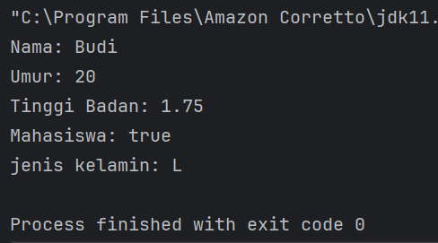


5. Latihan

Buatlah program untuk menampilkan data diri anda yang lengkap dengan attribut seperti berikut:

Nama Lengkap, Tempat Lahir, Tanggal Lahir, Golongan Darah, Umur,
Tinggi Badan, Jenis Kelamin, Agama, Pekerjaan.


````declarative
package modul_1.Latihan;

public class Latihan_1 {
    public static void main(String[] args) {
        int umur = 19;
        double tinggi = 1.75;
        boolean isMahasiswa = true;
        char jenisKelamin = 'L';
        String nama = "Ibra Khalid Londang";
        String tempatLahir = "Pangkalan Susu";
        String golonganDarah = "O";
        String agama = "Islam";
        String pekerjaan = "Pelajar";
        String tanggalLahir = "06 Mei 2026";


        System.out.println("Nama: " + nama);
        System.out.println("Umur: " + umur);
        System.out.println("Tinggi: " + tinggi);
        System.out.println("Mahasiswa: " + isMahasiswa);
        System.out.println("Jenis Kelamin: " + jenisKelamin);
    }
}

````

### Ouput:
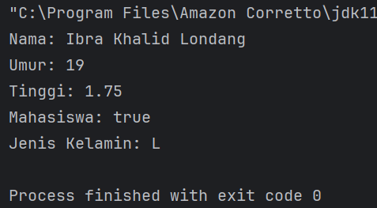


### Operator dan Expressi
   Operator digunakan untuk melakukan operasi pada variabel dan nilai. Jenis operator:

- Aritmatika: +, -, *, /, %
- Perbandingan: ==, !=, >, <, >=, <=
- Logika: && (AND), || (OR), ! (NOT)


### Langkah Praktikum 

1. Buat sebuah class baru di dalam package modul_1 dan beri nama Operator
2. Tuliskan kode berikut:


````declarative
package modul_1;

public class Operator {
public static void  main (String[] args) {
int a = 10;
int b = 5;

System.out.println("a + b = " + (a+b));
System.out.println("a > b? = " + (a > b));
System.out.println("a == b? = " + (a == b));

}
}


````

### Output:
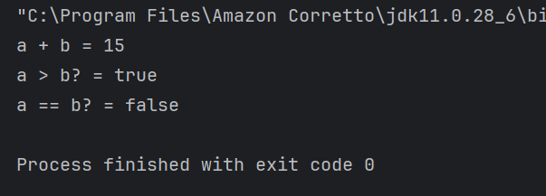

### Latihan:
````declarative
package modul_1.Latihan;

public class Latihan_2 {
    public static void  main (String[] args) {
        int a = 10;
        int b = 5;

        System.out.println("Luas Persegi Panjang = " + (a*b));


    }
}

````

### Output: 
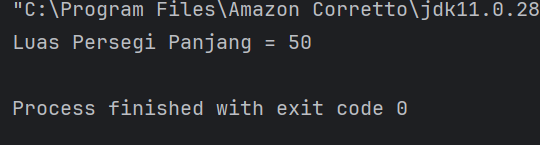


### Percabangan (If-Else dan Switch-Case)
   Percabangan digunakan untuk mengambil keputusan berdasarkan kondisi.

If-Else:

if (kondisi) {
// Blok kode jika kondisi true
} else {
// Blok kode jika kondisi false
}
Switch-Case:

switch (variabel) {
case nilai1:
// Blok kode jika variabel == nilai1
break;
case nilai2:
// Blok kode jika variabel == nilai2
break;
default:
// Blok kode jika tidak ada case yang sesuai
}


### Langkah Praktikum
1. Buat sebuah class baru di dalam package modul_1 dan beri nama Percabangan
2. Tuliskan kode berikut:

````declarative
package modul_1;

public class Percabangan {
    public  static  void main(String[] args){
        int nilai = 85;

        if (nilai >= 75) {
            System.out.println("Anda Lulus!");
        } else {
            System.out.println("Anda tidak lulus.");
        }
    }
}

````

### Output:
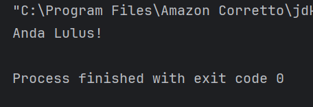


### Latihan
````declarative
package modul_1.Latihan;

public class Latihan_3 {
    public static void main (String[] args){
        int nilai = 15;

        if (nilai % 2 == 0) {
            System.out.println("Bilangan genap");
        } else {
            System.out.println("Bilangan ganjil");
        }
    }
}

````


### Output:
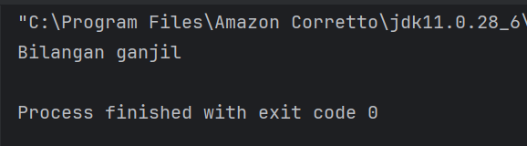


### Perulangan (For, While, Do-While)
Perulangan digunakan untuk mengulang blok kode.

For:

for (inisialisasi; kondisi; update) {
// Blok kode yang diulang
}
While:

while (kondisi) {
// Blok kode yang diulang
}
Do-While:

do {
// Blok kode yang diulang
} while (kondisi);


### Langkah Praktikum
1. Buat sebuah class baru di dalam package modul_1 dan beri nama Perulangan
2. Tuliskan kode berikut:


````declarative
package modul_1;

public class Perulangan {
public static void main(String[] args) {
for (int i = 1; i <= 5; i++) {
System.out.println("Iterasi ke-" + i);
}
}
}

````

### Output:
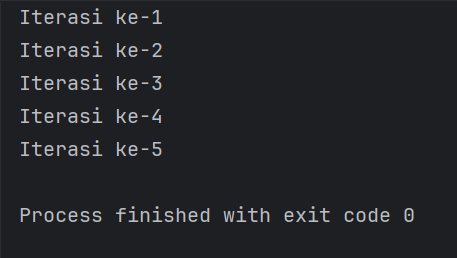


### Latihan
````declarative
package modul_1.Latihan;

public class Latihan_for_4 {
    public static void main(String[] args){
        for (int i = 1; i <= 20; i++) {
            if (i % 2 != 0) {
                System.out.println(i);
            }
        }
    }
}

````


````declarative
package modul_1.Latihan;

public class Latihan_while_5 {
    public static void main (String[] args) {
        int i = 1;
        while (i <= 20) {
            if (i % 2 != 0) {
                System.out.println(i);
            }
            i++;
        }
    }
}

````

````declarative
package modul_1.Latihan;

public class Latihan_doWhile_6 {
    public static void main (String[] args) {
        int i = 1;
        do{
            if (i % 2 != 0){
                System.out.println(i);
            }
            i++;
        } while (i <= 20);
    }
}

````


### Output:
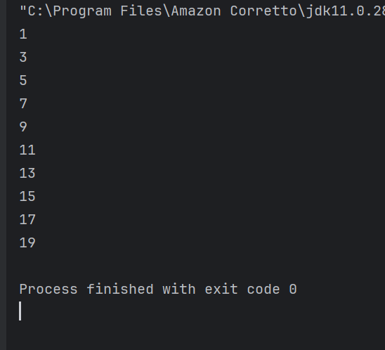


### Practice Problem dan Solusinya
   Practice Problem:

1. Buat program untuk menghitung faktorial dari suatu bilangan.
2. Buat program untuk mengecek apakah suatu bilangan adalah bilangan prima.
3. Buat program untuk mencetak pola segitiga menggunakan *.

#### Program 1:
````declarative
package modul_1;

public class Factorial {
    public static void main (String[] args){
        int n = 5;
        int hasil = 1;
        for (int i = 1; i <= n; i++) {
            hasil *= i;
        }
        System.out.println("Faktorial dari " + n + " adalah " + hasil);
    }
}

````

#### Output:
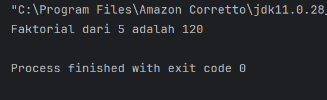


Buat sebuah class baru di dalam package modul_1 dan beri nama Prima dan isikan kode berikut. Kemudian jalankan untuk melihat hasilnya.

#### Program 2

````declarative
package modul_1;

public class Prima {
public static void main(String[] args) {
int n = 7;
boolean isPrima = true;
for ( int i = 2; i <= n / 2; i++) {
if (n % i == 0) {
isPrima = false;
break;
}
}
System.out.println(n + (isPrima ? " adalah bilangan prima." : " bukan bilangan prima. "));
}
}

````


#### Output
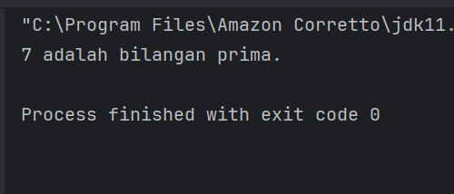


Buat sebuah class baru di dalam package modul_1 dan beri nama Segitiga dan isikan kode berikut. Kemudian jalankan untuk melihat hasilnya.


#### Program 3:
````declarative
package modul_1;

public class Segitiga {
    public static void main (String[] args) {
        int tinggi = 5;
        for (int i = 1; i <= tinggi; i++) {
            for (int j = 1; j <= i; j++) {
                System.out.print("*");
            }
            System.out.println();
        }
    }
}

````


#### Output:
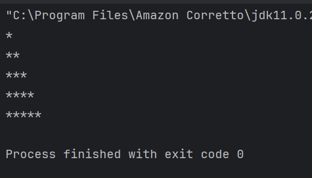


## Penutup
Dengan menyelesaikan modul ini, Anda telah mempelajari dasar-dasar pemrograman Java dan mampu membuat program sederhana. Lanjutkan dengan mempelajari konsep pemrograman yang lebih kompleks seperti array, method, dan pemrograman berorientasi objek


### selesai.