**Mata Kuliah:** Praktikum Design Pattern   
**Nama:** [Ibra Khalid Londang]  
**NIM:** [2024573010115]  
**Kelas:** [TI 1A]

---

# Praktikum 2: Review Konsep Dasar OOP Menggunakan Java

## 1. Class dan Object
   Class adalah blueprint atau cetakan untuk membuat objek. Class mendefinisikan atribut (variabel) dan method (fungsi) yang dimiliki oleh objek.
   Object adalah instance dari class. Object memiliki state (nilai dari atribut) dan behavior (method).
   
### Langkah Praktikum
- Buka project pada praktikum sebelumnya menggunakan intellij IDEA 
- Buat sebuah package baru di dalam folder src dengan cara klik kanan pada folder src kemudian pilih New -> Package. Beri nama modul_2. 
- Buat Sebuah package baru lagi didalam package modul_2 dengan cara klik kanan dan pilih New -> Package. Beri nama bagian_1 
- Kemudian buat sebuah class baru dengan nama Mahasiswa dan isikan kode berikut:

````declarative
package modul_2.bagian_1;

public class Mahasiswa {
    String nama;
    int umur;
}

````


````declarative
package modul_2.bagian_1;

public class Main {
    public static void main(String[] args) {
        // Membuat object dari class Mahasiswa
        Mahasiswa mhs1 = new Mahasiswa();

        // Mengisi nilai atribut
        mhs1.nama = "Budi";
        mhs1.umur = 20;

        // Menampilkan nilai atribut
        System.out.println("Nama: " + mhs1.nama);
        System.out.println("Umur: " + mhs1.umur);
    }
}
````

Output:
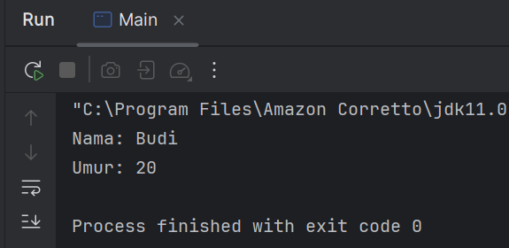


## 2. Attribute dan Method
   Attribute adalah variabel yang dimiliki oleh class atau object.
   Method adalah fungsi atau perilaku yang dimiliki oleh class atau object.
   
### Langkah Praktikum
- Buat Sebuah package baru lagi didalam package modul_2 dengan cara klik kanan dan pilih New -> Package. Beri nama bagian_2 
- Kemudian buat sebuah class baru dengan nama Kalkulator dan isikan kode berikut:


````declarative
package modul_2.bagian_2;

public class Kalkulator {
    int angka1;
    int angka2;

    int tambah(){
        return angka1 + angka2;
    }
}

````

````declarative
package modul_2.bagian_2;

public class Main {
    public static void main(String[] args) {
        Kalkulator kalkulator = new Kalkulator();
        kalkulator.angka1 = 5;
        kalkulator.angka2 = 10;

        System.out.println("Hasil Penjumlahan: " + kalkulator.tambah());
    }
}
````


Output:
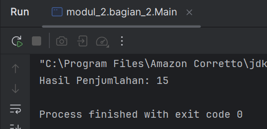


## 3. Akses Modifier
   1. Akses Modifier menentukan tingkat akses dari class, atribut, atau method.
   2. Jenis akses modifier:
   - public : Dapat diakses dari mana saja.
   - private : Hanya dapat diakses dalam class yang sama.
   - protected : Dapat diakses dalam package yang sama dan subclass.
   - default : Hanya dapat diakses dalam package yang sama.
  
### Langkah Praktikum
   1. Buat Sebuah package baru lagi didalam package modul_2 dengan cara klik kanan dan pilih New -> Package. Beri nama bagian_3
   2. Kemudian buat sebuah class baru dengan nama AksesModifier dan isikan kode berikut:


````declarative
package modul_2.bagian_3;

public class AccesModifier {
    public int publicVar = 1;
    private int privateVar = 2;
    protected int protectedVar = 3;
    int defaultVar = 4; // default

    public void tampilkan() {
        System.out.println("Public: " + publicVar);
        System.out.println("Private: " + privateVar);
        System.out.println("Protected: " + protectedVar);
        System.out.println("Default: " + defaultVar);
    }
}
````


````declarative
package modul_2.bagian_3;

public class Main {
    public static void main(String[] args) {
        AccesModifier contoh = new AccesModifier();
        contoh.tampilkan();

        // System.out.println(contoh.privateVar); // Error: privateVar tidak dapat diakses
    }
}
````


Output:
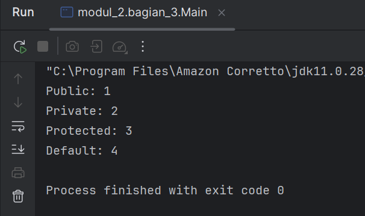


## 4. Setter dan Getter
   1. Setter adalah method untuk mengubah nilai atribut.
   2. Getter adalah method untuk mengambil nilai atribut.
   3. Setter dan Getter digunakan untuk mengakses atribut yang memiliki akses modifier private.
   

### Langkah Praktikum
   1. Buat Sebuah package baru lagi didalam package modul_2 dengan cara klik kanan dan pilih New -> Package. Beri nama bagian_4
   2. Kemudian buat sebuah class baru dengan nama Mobil dan isikan kode berikut:


````declarative
package modul_2.bagian_4;

public class Mobil {
    private String merk;

    // Setter
    public void setMerk(String merk) {
        this.merk = merk;
    }

    // Getter
    public String getMerk() {
        return merk;
    }
}
````

````declarative
package modul_2.bagian_4;

public class Main {
    public static void main(String[] args) {
        Mobil mobil = new Mobil();
        mobil.setMerk("Toyota");

        System.out.println("Merk Mobil: " + mobil.getMerk());
    }
}
````


Output:
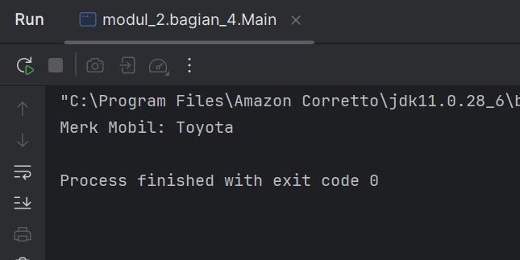


## 5. Constructor
   1. Constructor adalah method khusus yang dipanggil saat object dibuat.
   2. Jenis constructor:

   - Default Constructor : Tanpa parameter.
   - Parameterized Constructor : Dengan parameter.
   - Constructor Overloading : Beberapa constructor dengan parameter berbeda.
   
   
### Langkah Praktikum
   1. Buat Sebuah package baru lagi didalam package modul_2 dengan cara klik kanan dan pilih New -> Package. Beri nama bagian_5
   2. Kemudian buat sebuah class baru dengan nama Person dan isikan kode berikut:


````declarative
package modul_2.bagian_5;

public class Person {
    private String nama;
    private int umur;

    // Default Constructor
    public Person() {
        nama = "Unknown";
        umur = 0;
    }

    // Parameterized Constructor
    public Person(String nama, int umur) {
        this.nama = nama;
        this.umur = umur;
    }

    // Method
    public void tampilkanInfo() {
        System.out.println("Nama: " + nama);
        System.out.println("Umur: " + umur);
    }
}
````

````declarative
package modul_2.bagian_5;

public class Main {
    public static void main(String[] args) {
        Person person1 = new Person();
        Person person2 = new Person("Budi", 25);

        person1.tampilkanInfo();
        person2.tampilkanInfo();
    }
}
````

Output:
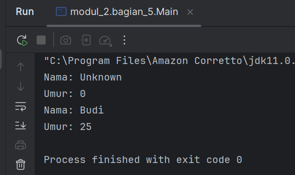


## 6. Sistem Manajemen Perpustakaan Sederhana
   Berikut adalah contoh program konsol sederhana yang mengimplementasikan seluruh konsep yang telah dibahas sebelumnya, yaitu class, object, attribute, method, akses modifier, setter-getter, dan constructor. Program ini adalah sistem manajemen perpustakaan sederhana yang memungkinkan pengguna untuk menambahkan buku, menampilkan daftar buku, dan mencari buku berdasarkan judul.

### Langkah Praktikum
1. Buat Sebuah package baru lagi didalam package modul_2 dengan cara klik kanan dan pilih New -> Package. Beri nama bagian_6
2. Kemudian buat sebuah class baru dengan nama Buku dan isikan kode berikut:


````declarative
package modul_2.bagian_6;

public class Buku {
    // Atribut (private)
    private String judul;
    private String pengarang;
    private int tahunTerbit;

    // Constructor (default)
    public Buku() {
        this.judul = "Unknown";
        this.pengarang = "Unknown";
        this.tahunTerbit = 0;
    }

    // Constructor (parameterized)
    public Buku(String judul, String pengarang, int tahunTerbit) {
        this.judul = judul;
        this.pengarang = pengarang;
        this.tahunTerbit = tahunTerbit;
    }

    // Setter dan Getter
    public void setJudul(String judul) {
        this.judul = judul;
    }

    public String getJudul() {
        return judul;
    }

    public void setPengarang(String pengarang) {
        this.pengarang = pengarang;
    }

    public String getPengarang() {
        return pengarang;
    }

    public void setTahunTerbit(int tahunTerbit) {
        this.tahunTerbit = tahunTerbit;
    }

    public int getTahunTerbit() {
        return tahunTerbit;
    }

    // Method untuk menampilkan informasi buku
    public void tampilkanInfo() {
        System.out.println("Judul: " + judul);
        System.out.println("Pengarang: " + pengarang);
        System.out.println("Tahun Terbit: " + tahunTerbit);
        System.out.println("------------------------------------");
    }
}
````


````declarative
package modul_2.bagian_6;

import java.util.ArrayList;

public class Perpustakaan {
    // Atribut (private)
    private ArrayList<Buku> daftarBuku;

    // Constructor
    public Perpustakaan() {
        daftarBuku = new ArrayList<>();
    }

    // Method untuk menambahkan buku
    public void tambahBuku(Buku buku) {
        daftarBuku.add(buku);
        System.out.println("Buku berhasil ditambahkan!");
    }

    // Method untuk menampilkan semua buku
    public void tampilkanSemuaBuku() {
        if (daftarBuku.isEmpty()) {
            System.out.println("Tidak ada buku dalam perpustakaan.");
        } else {
            System.out.println("Daftar Buku:");
            for (Buku buku : daftarBuku) {
                buku.tampilkanInfo();
            }
        }
    }

    // Method untuk mencari buku berdasarkan judul
    public void cariBuku(String judul) {
        boolean ditemukan = false;
        for (Buku buku : daftarBuku) {
            if (buku.getJudul().equalsIgnoreCase(judul)) {
                System.out.println("Buku ditemukan:");
                buku.tampilkanInfo();
                ditemukan = true;
                break;
            }
        }
        if (!ditemukan) {
            System.out.println("Buku dengan judul \"" + judul + "\" tidak ditemukan.");
        }
    }
}
````


````declarative
package modul_2.bagian_6;

import java.util.Scanner;

public class Main {
    public static void main(String[] args) {
        Scanner scanner = new Scanner(System.in);
        Perpustakaan perpustakaan = new Perpustakaan();
        int pilihan;

        do {
            // Menu
            System.out.println("\n=== Sistem Manajemen Perpustakaan ===");
            System.out.println("1. Tambah Buku");
            System.out.println("2. Tampilkan Semua Buku");
            System.out.println("3. Cari Buku");
            System.out.println("4. Keluar");
            System.out.print("Pilih menu: ");
            pilihan = scanner.nextInt();
            scanner.nextLine(); // Membersihkan newline

            switch (pilihan) {
                case 1:
                    // Tambah Buku
                    System.out.print("Masukkan judul buku: ");
                    String judul = scanner.nextLine();
                    System.out.print("Masukkan nama pengarang: ");
                    String pengarang = scanner.nextLine();
                    System.out.print("Masukkan tahun terbit: ");
                    int tahunTerbit = scanner.nextInt();
                    scanner.nextLine(); // Membersihkan newline

                    Buku bukuBaru = new Buku(judul, pengarang, tahunTerbit);
                    perpustakaan.tambahBuku(bukuBaru);
                    break;

                case 2:
                    // Tampilkan Semua Buku
                    perpustakaan.tampilkanSemuaBuku();
                    break;

                case 3:
                    // Cari Buku
                    System.out.print("Masukkan judul buku yang dicari: ");
                    String judulCari = scanner.nextLine();
                    perpustakaan.cariBuku(judulCari);
                    break;

                case 4:
                    // Keluar
                    System.out.println("Terima kasih telah menggunakan sistem ini!");
                    break;

                default:
                    System.out.println("Pilihan tidak valid. Silakan coba lagi.");
            }
        } while (pilihan != 4);

        scanner.close();
    }
}
````


Output:
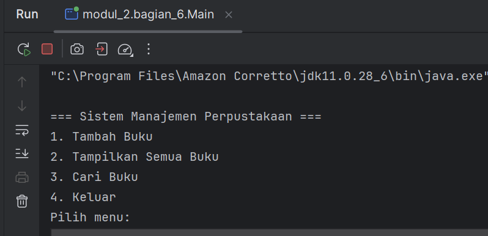


---


# Praktikum 3: Review 4 Pilar OOP Menggunakan Java


## Bagian 1 - Pengenalan OOP dan Class-Object
OOP (Object-Oriented Programming) adalah paradigma pemrograman yang menggunakan "objek" untuk merepresentasikan data dan metode yang beroperasi pada data tersebut. Konsep dasar OOP:

1. Class: Blueprint atau template untuk membuat objek.
2. Object: Instance dari class yang memiliki atribut dan metode.

### Langkah Praktikum
1. Buka project pada praktikum sebelumnya menggunakan intellij IDEA
2. Buat sebuah package baru di dalam folder src dengan cara klik kanan pada folder src kemudian pilih New -> Package. Beri nama modul_3.
3. Buat Sebuah package baru lagi didalam package modul_3 dengan cara klik kanan dan pilih New -> Package. Beri nama bagian_1
4. Kemudian buat sebuah class baru dengan nama Mahasiswa dan isikan kode berikut:

````declarative
package modul_3.bagian_1;

public class Mahasiswa {
///Atribut
String nama;
int umur;

void displayInfo() {
System.out.println("Nama: " + nama);
System.out.println("umur: " + umur);
}
}


````

````declarative
package modul_3.bagian_1;

public class Main {
    public static void main(String[] args) {
        Mahasiswa mhs1 = new Mahasiswa() ;
        mhs1.nama = "budi";
        mhs1.umur = 20;

        mhs1.displayInfo();

    }
}

````

4. Jalankan program

## Bagian 2 - Encapsulation (Enkapsulasi)
Encapsulation adalah konsep menyembunyikan detail internal objek dan hanya mengekspos fungsionalitas yang diperlukan. Ini dilakukan dengan menggunakan access modifier (private, public, protected) dan getter-setter.

Langkah Praktikum
1. Buat Sebuah package baru lagi didalam package modul_3 dengan cara klik kanan dan pilih New -> Package. Beri nama bagian_2
2. Kemudian buat sebuah class baru dengan nama Mahasiswa dan isikan kode berikut:

````declarative
package modul_3.bagian_2;

import java.security.SecureRandom;

public class Mahasiswa {
    private String nama;
    private int umur;

    public String getNama() {
        return nama;
    }

    public void setNama(String nama){
        this.nama = nama;
    }

    public int getUmur(){
        return umur;
    }

    public void setUmur(int umur) {
        this.umur = umur;
    }
}

````

````declarative
package modul_3.bagian_2;

public class Main {
    public static void main(String[] args){
        Mahasiswa mhs1 = new Mahasiswa();

        mhs1.setNama("Budi");
        mhs1.setUmur(20);

        System.out.println("Nama: " + mhs1.getNama());
        System.out.println("Umur: " + mhs1.getUmur());
    }
}

````


Output:
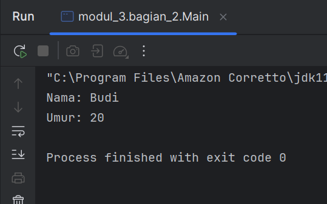


## Bagian 3 - Inheritance (Pewarisan) dan Composition (Komposisi)
Dalam pemrograman berorientasi objek (OOP), Inheritance dan Composition adalah dua konsep penting yang digunakan untuk membangun hubungan antara class. Meskipun keduanya memiliki tujuan yang sama, yaitu mempromosikan reuseability (penggunaan kembali kode) dan modularitas, mereka memiliki pendekatan yang berbeda. Berikut adalah penjelasan lengkap tentang Composition dan perbandingannya dengan Inheritance.

#### Inheritance (Pewarisan)
Inheritance adalah mekanisme di mana sebuah class (subclass/child class) mewarisi atribut dan metode dari class lain (superclass/parent class). Inheritance menggambarkan hubungan "is-a" (adalah). Misalnya, Kucing adalah Hewan.

#### Ciri-Ciri Inheritance:
- Menggunakan keyword extends.
- Subclass mewarisi semua atribut dan metode dari superclass (kecuali yang private).
- Subclass dapat menambahkan atribut dan metode baru, atau meng-override metode yang ada.
- Mendukung hierarki class (class dapat mewarisi dari satu superclass). 

### Langkah Praktikum
1. Buat Sebuah package baru lagi didalam package modul_3 dengan cara klik kanan dan pilih New -> Package. Beri nama bagian_3
2. Buat package baru di dalam bagian_3 dan beri nama pewarisan
3. Kemudian buat sebuah class baru dengan nama Kendaraan dan isikan kode berikut:


````declarative
package modul_3.bagian_3.pewarisan;

class Kendaraan {
String merk;
int tahun;

void displayInfo() {
System.out.println("Merk: " + merk);
System.out.println("Tahun: " + tahun);
}
}


````

````declarative
package modul_3.bagian_3.pewarisan;

class Mobil extends Kendaraan {
    int jumlahPintu;

    void displayInfoMobil() {
        displayInfo(); // Memanggil metode dari superclass
        System.out.println("Jumlah Pintu: " + jumlahPintu);
    }
}

````

````declarative
package modul_3.bagian_3.pewarisan;


public class Main {
    public static void main(String[] args) {
        Mobil mobil1 = new Mobil();
        mobil1.merk = "Toyota";
        mobil1.tahun = 2021;
        mobil1.jumlahPintu = 4;

        mobil1.displayInfoMobil();
    }
}
````

Output:
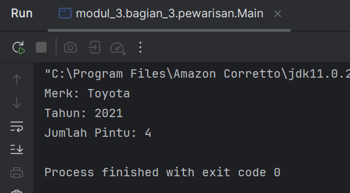


#### Composition (Komposisi)
Composition adalah mekanisme di mana sebuah class terdiri dari objek-objek dari class lain. Ini menggambarkan hubungan "has-a" (memiliki). Misalnya, Mobil memiliki Mesin. Composition memungkinkan kita untuk membangun class yang kompleks dengan menggabungkan objek-objek yang lebih sederhana.

#### Ciri-Ciri Composition:
- Menggunakan instance variabel dari class lain.
- Tidak ada keyword khusus, hanya menggunakan objek sebagai atribut.
- Lebih fleksibel daripada inheritance karena tidak terikat pada hierarki class.
- Mendukung reuseability tanpa perlu mewarisi class.

### Langkah Praktikum
1. Buat package baru di dalam bagian_3 dan beri nama komposisi
2. Kemudian buat sebuah class baru dengan nama Mesin dan isikan kode berikut:

````declarative
package modul_3.bagian_3.komposisi;

class Mesin {
    void hidupkan() {
        System.out.println("Mesin menyala.");
    }

    void matikan() {
        System.out.println("Mesin dimatikan.");
    }
}
````

````declarative
package modul_3.bagian_3.komposisi;

class Mobil {
    private final Mesin mesin; // Composition

    public Mobil() {
        this.mesin = new Mesin(); // Membuat objek Mesin
    }

    void mulai() {
        mesin.hidupkan();
        System.out.println("Mobil siap digunakan.");
    }

    void berhenti() {
        mesin.matikan();
        System.out.println("Mobil berhenti.");
    }
}

````


````declarative
package modul_3.bagian_3.komposisi;

public class Main {
    public static void main(String[] args) {
        Mobil mobil = new Mobil();

        mobil.mulai();
        mobil.berhenti();
    }
}

````

Output:
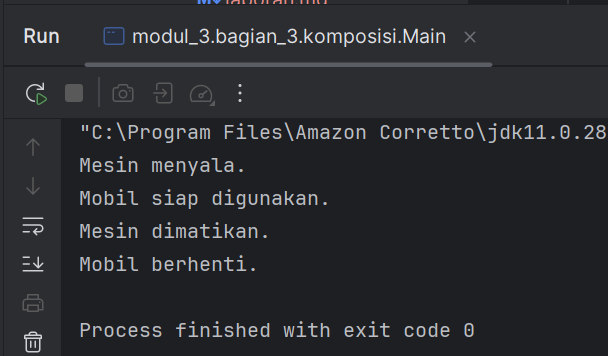


## Bagian 4 - Polymorphism (Polimorfisme)
Polymorphism memungkinkan objek untuk memiliki banyak bentuk. Ini dapat dicapai melalui method overriding (mengganti metode di subclass) dan method overloading (beberapa metode dengan nama sama tetapi parameter berbeda).

#### Method Overriding
Method overriding terjadi ketika subclass (class anak) menyediakan implementasi spesifik untuk method yang sudah didefinisikan di superclass (class induk). Method overriding digunakan untuk mengubah atau memperluas perilaku method yang diwarisi dari superclass. Method yang di-override harus memiliki nama, parameter, dan return type yang sama dengan method di superclass.

#### Aturan Method Overriding:
- Method harus memiliki nama dan parameter yang sama dengan method di superclass.
- Return type harus sama atau subtype dari return type di superclass.
- Access modifier tidak boleh lebih restriktif daripada method di superclass (misalnya, jika method di superclass protected, method di subclass bisa protected atau public).
- Method tidak bisa di-override jika di superclass dideklarasikan sebagai final.

### Langkah Praktikum
1. Buat Sebuah package baru lagi didalam package modul_3 dengan cara klik kanan dan pilih New -> Package. Beri nama bagian_4
2. Kemudian buat sebuah package baru di dalam bagian_4 dan beri nama overriding
3. Kemudian buat sebuah class baru dengan nama Hewan dan isikan kode berikut:

````declarative
package modul_3.bagian_4.overriding;

public class Hewan {
    void bersuara(){
        System.out.println("Hewan bersuara. ");
    }
}

````

````declarative
package modul_3.bagian_4.overriding;

class Kucing extends Hewan {
    @Override
    void bersuara(){
        System.out.println("Meong. ");
    }

}

````

````declarative
package modul_3.bagian_4.overriding;

class Anjing extends Hewan {
    @Override
    void bersuara(){
        System.out.println("Guk Guk. ");
    }

}

````

````
package modul_3.bagian_4.overriding;

public class Main {
    public static void  main (String[] args){
        Hewan hewan1 = new Kucing();
        Hewan hewan2 = new Anjing();

        hewan1.bersuara();
        hewan2.bersuara();
    }
}

````


Output:
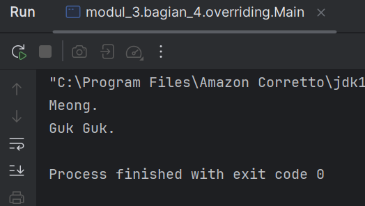


#### Method Overloading
Method overloading terjadi ketika sebuah class memiliki beberapa method dengan nama yang sama tetapi parameter yang berbeda (baik jumlah atau tipe parameternya). Method overloading digunakan untuk meningkatkan fleksibilitas dengan menyediakan beberapa cara untuk memanggil method yang sama.

#### Aturan Method Overloading:
- Method harus memiliki nama yang sama.
- Parameter harus berbeda (jumlah atau tipe).
- Return type bisa sama atau berbeda (tidak mempengaruhi overloading).
- Access modifier bisa sama atau berbeda.

### Langkah Praktikum
1. Buat sebuah package baru di dalam bagian_4 dan beri nama overloading
2. Kemudian buat sebuah class baru dengan nama Kalkulator dan isikan kode berikut:

````declarative
package modul_3.bagian_4.overloading;

class Kalkulator {
    // Method overloading: penjumlahan dua bilangan bulat
    int tambah(int a, int b) {
        return a + b;
    }

    // Method overloading: penjumlahan tiga bilangan bulat
    int tambah(int a, int b, int c) {
        return a + b + c;
    }

    // Method overloading: penjumlahan dua bilangan desimal
    double tambah(double a, double b) {
        return a + b;
    }
}
````


````declarative
package modul_3.bagian_4.overloading;

public class Main {
    public static void main(String[] args) {
        Kalkulator kalkulator = new Kalkulator();

        System.out.println("Hasil 1: " + kalkulator.tambah(5, 10));      // Output: 15
        System.out.println("Hasil 2: " + kalkulator.tambah(5, 10, 15));  // Output: 30
        System.out.println("Hasil 3: " + kalkulator.tambah(3.5, 2.5));   // Output: 6.0
    }
}
````

Output:
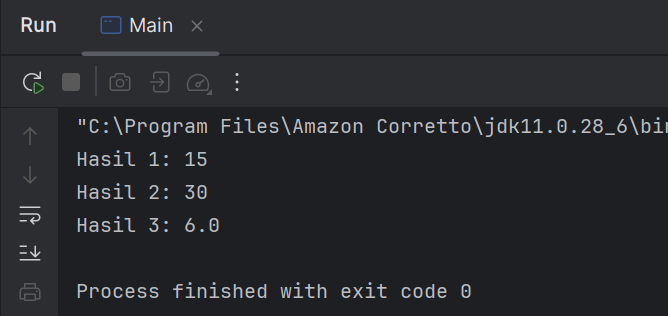


## Bagian 5 - Abstraction (Abstraksi) | Abstract Class dan Interface
Pada konsep OOP (Object-Oriented Programming), Abstraction adalah salah satu dari empat pilar utama (bersama Encapsulation, Inheritance, dan Polymorphism). Abstraction memungkinkan kita untuk menyembunyikan detail implementasi dan hanya menampilkan fungsionalitas yang diperlukan kepada pengguna. Di Java, abstraction dapat diimplementasikan menggunakan Abstract Class dan Interface.

#### Abstract Class
Abstract class adalah class yang tidak dapat diinstansiasi (tidak bisa dibuat objeknya langsung). Abstract class dapat memiliki method abstrak (tanpa implementasi) dan method konkret (dengan implementasi). Abstract class digunakan ketika kita ingin membuat blueprint untuk class-class lain yang memiliki perilaku serupa tetapi dengan implementasi yang berbeda.

#### Ciri-Ciri Abstract Class:
- Dideklarasikan dengan keyword abstract.
- Dapat memiliki atribut, method konkret, dan method abstrak.
- Method abstrak tidak memiliki body (hanya deklarasi).
- Subclass yang mewarisi abstract class harus mengimplementasikan semua method abstrak (kecuali subclass tersebut juga abstract).

### Langkah Praktikum
1. Buat Sebuah package baru lagi didalam package modul_3 dengan cara klik kanan dan pilih New -> Package. Beri nama bagian_5
2. Buat sebuah package baru di dalam bagian_5 dan beri nama abstrak.
3. Kemudian buat sebuah class baru di dalam abtrak dengan nama Hewan dan isikan kode berikut:

````declarative
package modul_3.bagian_5.abstrak;

abstract class Hewan {
    // Atribut
    String nama;

    // Method konkret
    void makan() {
        System.out.println(nama + " sedang makan.");
    }

    // Method abstrak
    abstract void bersuara();
}
````

````declarative
package modul_3.bagian_5.abstrak;

class Anjing extends Hewan {
    @Override
    void bersuara() {
        System.out.println("Guk Guk!");
    }
}

````

````declarative
package modul_3.bagian_5.abstrak;

// Subclass dari abstract class
class Kucing extends Hewan {
    @Override
    void bersuara() {
        System.out.println("Meong!");
    }
}
````

````declarative
package modul_3.bagian_5.abstrak;


public class Main {
    public static void main(String[] args) {
        Hewan kucing = new Kucing();
        kucing.nama = "Kitty";
        kucing.makan();      // Method konkret dari abstract class
        kucing.bersuara();   // Method abstrak yang di-override

        Hewan anjing = new Anjing();
        anjing.nama = "Doggy";
        anjing.makan();      // Method konkret dari abstract class
        anjing.bersuara();   // Method abstrak yang di-override
    }
}

````

Output:
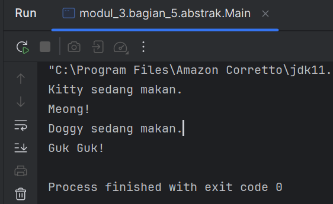


#### Interface
Interface adalah blueprint untuk class yang hanya berisi method abstrak (sebelum Java 8) atau method default/static (mulai Java 8). Interface digunakan untuk mendefinisikan kontrak (contract) yang harus diimplementasikan oleh class-class yang menggunakannya. Sebuah class dapat mengimplementasikan banyak interface (multiple inheritance).

#### Ciri-Ciri Interface:
- Dideklarasikan dengan keyword interface.
- Semua method di interface secara default adalah public dan abstract (tidak perlu menuliskan keyword abstract).
- Mulai Java 8, interface dapat memiliki method default (dengan implementasi) dan method static.
- Mulai Java 9, interface dapat memiliki method private.
- Interface tidak dapat memiliki atribut non-static (hanya konstanta, yaitu public static final).


### Langkah Praktikum
1. Buat sebuah package baru di dalam bagian_5 dan beri nama antarmuka.
2. Kemudian buat sebuah interface baru di dalam antarmuka dengan nama Bergerak dan isikan kode berikut:

````declarative
package modul_3.bagian_5.antarmuka;

// Interface
interface Bergerak {
    // Method abstrak
    void bergerak();

    // Method default (Java 8+)
    default void berhenti() {
        System.out.println("Berhenti bergerak.");
    }

    // Method static (Java 8+)
    static void info() {
        System.out.println("Ini adalah interface Bergerak.");
    }
}

````


````declarative
package modul_3.bagian_5.antarmuka;

class Mobil implements Bergerak {
    @Override
    public void bergerak() {
        System.out.println("Mobil sedang melaju.");
    }
}

````

````declarative
package modul_3.bagian_5.antarmuka;

class Pesawat implements Bergerak {
    @Override
    public void bergerak() {
        System.out.println("Pesawat sedang terbang.");
    }
}

````

````declarative
package modul_3.bagian_5.antarmuka;

public class Main {
    public static void main(String[] args) {
        Bergerak mobil = new Mobil();
        mobil.bergerak(); // Method dari interface
        mobil.berhenti(); // Method default dari interface

        Bergerak pesawat = new Pesawat();
        pesawat.bergerak(); // Method dari interface
        pesawat.berhenti(); // Method default dari interface

        Bergerak.info(); // Method static dari interface
    }
}

````


Output:
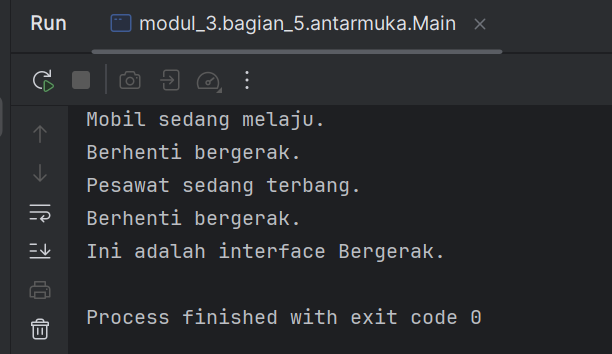


## Bagian 6 - Aplikasi Console Pemesanan Tiket Sederhana
Berikut adalah contoh aplikasi console pemesanan tiket untuk sebuah konferensi yang mengimplementasikan seluruh konsep OOP (Class, Object, Encapsulation, Inheritance, Polymorphism, dan Abstraction). Aplikasi ini memiliki fitur lengkap seperti:

#### Menampilkan daftar tiket yang tersedia.
- Memesan tiket.
- Melihat detail pesanan.
- Membatalkan pesanan.
- Menghitung total harga.
- Menerapkan diskon berdasarkan jenis tiket.


### Langkah Praktikum
1. Buat Sebuah package baru lagi didalam package modul_3 dengan cara klik kanan dan pilih New -> Package. Beri nama bagian_6
2. Kemudian buat sebuah class baru dengan nama Tiket dan isikan kode berikut:

````declarative
package modul_3.bagian_6;

abstract class Tiket {
    private final String jenis;
    private final double harga;

    public Tiket(String jenis, double harga) {
        this.jenis = jenis;
        this.harga = harga;
    }

    public String getJenis() {
        return jenis;
    }

    public double getHarga() {
        return harga;
    }

    // Abstract method untuk menghitung diskon
    public abstract double hitungDiskon();
}

````

````declarative
package modul_3.bagian_6;

class TiketReguler extends Tiket {
    public TiketReguler() {
        super("Reguler", 100000); // Harga tiket reguler
    }

    @Override
    public double hitungDiskon() {
        return 0; // Tidak ada diskon untuk tiket reguler
    }
}

````

````declarative
package modul_3.bagian_6;

class TiketVIP extends Tiket {
    public TiketVIP() {
        super("VIP", 250000); // Harga tiket VIP
    }

    @Override
    public double hitungDiskon() {
        return 0.1 * getHarga(); // Diskon 10% untuk tiket VIP
    }
}

````

````declarative
package modul_3.bagian_6;

class Pesanan {
    private final String namaPemesan;
    private final Tiket tiket;
    private final int jumlah;

    public Pesanan(String namaPemesan, Tiket tiket, int jumlah) {
        this.namaPemesan = namaPemesan;
        this.tiket = tiket;
        this.jumlah = jumlah;
    }

    public String getNamaPemesan() {
        return namaPemesan;
    }

    public Tiket getTiket() {
        return tiket;
    }

    public int getJumlah() {
        return jumlah;
    }

    // Menghitung total harga setelah diskon
    public double hitungTotal() {
        double total = tiket.getHarga() * jumlah;
        double diskon = tiket.hitungDiskon() * jumlah;
        return total - diskon;
    }

    // Menampilkan detail pesanan
    public void displayDetail() {
        System.out.println("\nDetail Pesanan:");
        System.out.println("Nama Pemesan: " + namaPemesan);
        System.out.println("Jenis Tiket: " + tiket.getJenis());
        System.out.println("Jumlah: " + jumlah);
        System.out.println("Total Harga: Rp" + hitungTotal());
    }
}

````

````declarative
package modul_3.bagian_6;

import java.util.ArrayList;
import java.util.Scanner;

public class KonferensiApp {
    private static final ArrayList<Pesanan> daftarPesanan = new ArrayList<>();
    private static final Scanner scanner = new Scanner(System.in);

    public static void main(String[] args) {
        while (true) {
            System.out.println("\n=== Aplikasi Pemesanan Tiket Konferensi ===");
            System.out.println("1. Lihat Daftar Tiket");
            System.out.println("2. Pesan Tiket");
            System.out.println("3. Lihat Detail Pesanan");
            System.out.println("4. Batalkan Pesanan");
            System.out.println("5. Keluar");
            System.out.print("Pilih menu: ");

            int pilihan = scanner.nextInt();
            scanner.nextLine(); // Membersihkan newline

            switch (pilihan) {
                case 1:
                    lihatDaftarTiket();
                    break;
                case 2:
                    pesanTiket();
                    break;
                case 3:
                    lihatDetailPesanan();
                    break;
                case 4:
                    batalkanPesanan();
                    break;
                case 5:
                    System.out.println("Terima kasih telah menggunakan aplikasi ini.");
                    System.exit(0);
                default:
                    System.out.println("Pilihan tidak valid. Silakan coba lagi.");
            }
        }
    }

    // Method untuk menampilkan daftar tiket
    private static void lihatDaftarTiket() {
        System.out.println("\nDaftar Tiket:");
        System.out.println("1. Tiket Reguler - Rp100.000");
        System.out.println("2. Tiket VIP - Rp250.000 (Diskon 10%)");
    }

    // Method untuk memesan tiket
    private static void pesanTiket() {
        System.out.print("\nMasukkan nama pemesan: ");
        String namaPemesan = scanner.nextLine();

        System.out.print("Pilih jenis tiket (1: Reguler, 2: VIP): ");
        int jenisTiket = scanner.nextInt();
        System.out.print("Masukkan jumlah tiket: ");
        int jumlah = scanner.nextInt();

        Tiket tiket = null;
        switch (jenisTiket) {
            case 1:
                tiket = new TiketReguler();
                break;
            case 2:
                tiket = new TiketVIP();
                break;
            default:
                System.out.println("Jenis tiket tidak valid.");
                return;
        }

        Pesanan pesanan = new Pesanan(namaPemesan, tiket, jumlah);
        daftarPesanan.add(pesanan);
        System.out.println("Pesanan berhasil dibuat!");
        pesanan.displayDetail();
    }

    // Method untuk melihat detail pesanan
    private static void lihatDetailPesanan() {
        if (isNoPesanan()) return;

        System.out.print("Pilih nomor pesanan untuk melihat detail: ");
        int nomorPesanan = scanner.nextInt();

        if (nomorPesanan > 0 && nomorPesanan <= daftarPesanan.size()) {
            daftarPesanan.get(nomorPesanan - 1).displayDetail();
        } else {
            System.out.println("Nomor pesanan tidak valid.");
        }
    }

    private static boolean isNoPesanan() {
        if (daftarPesanan.isEmpty()) {
            System.out.println("\nBelum ada pesanan.");
            return true;
        }

        System.out.println("\nDaftar Pesanan:");
        for (int i = 0; i < daftarPesanan.size(); i++) {
            System.out.println((i + 1) + ". " + daftarPesanan.get(i).getNamaPemesan());
        }
        return false;
    }

    // Method untuk membatalkan pesanan
    private static void batalkanPesanan() {
        if (isNoPesanan()) return;

        System.out.print("Pilih nomor pesanan yang ingin dibatalkan: ");
        int nomorPesanan = scanner.nextInt();

        if (nomorPesanan > 0 && nomorPesanan <= daftarPesanan.size()) {
            daftarPesanan.remove(nomorPesanan - 1);
            System.out.println("Pesanan berhasil dibatalkan.");
        } else {
            System.out.println("Nomor pesanan tidak valid.");
        }
    }
}
````

Output:
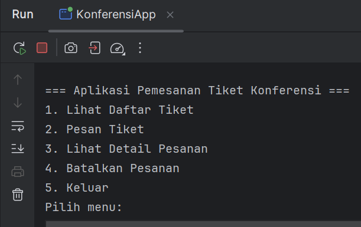


#### Fitur Apliaksi:
1. Lihat Daftar Tiket: Menampilkan jenis tiket dan harganya. 
2. Pesan Tiket: Memungkinkan pengguna memesan tiket dengan memilih jenis dan jumlah.
3. Lihat Detail Pesanan: Menampilkan detail pesanan berdasarkan nomor pesanan.
4. Batalkan Pesanan: Menghapus pesanan berdasarkan nomor pesanan.
5. Hitung Total Harga: Menghitung total harga setelah diskon (jika ada).


#### Penjelasan Program:
1. Encapsulation: Atribut seperti jenis dan harga dienkapsulasi dalam class Tiket.
2. Inheritance: TiketReguler dan TiketVIP mewarisi class Tiket.
3. Polymorphism: Method hitungDiskon() di-override di subclass.
4. Abstraction: Class Tiket adalah abstract class dengan method abstrak hitungDiskon().
5. Aplikasi ini siap digunakan dan dapat dikembangkan lebih lanjut dengan menambahkan fitur seperti penyimpanan data ke file atau database. Selamat mencoba!


### Selesai
