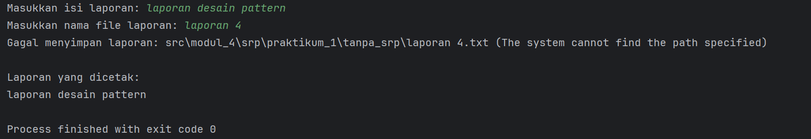
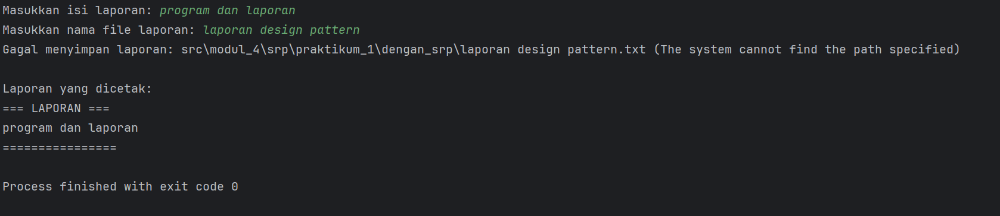
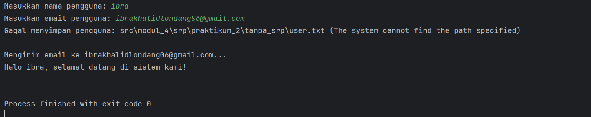
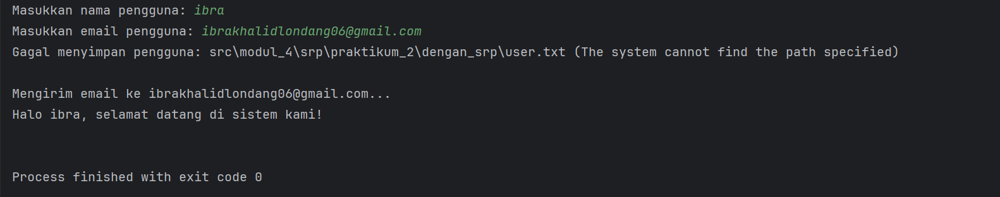
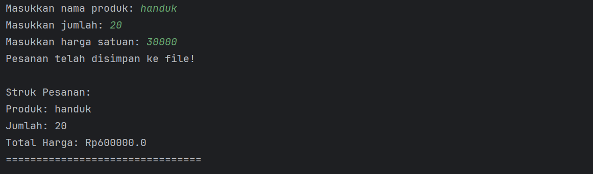

**Mata Kuliah:** Praktikum Design Pattern   
**Nama:** [Ibra Khalid Londang]  
**NIM:** [2024573010115]  
**Kelas:** [TI 1A]

---

# Praktikum 4: SOLID Principle : Single Responsibility Principle (SRP)


## Tujuan
1. Memahami prinsip Single Responsibility Principle (SRP) dalam SOLID.
2. Mengetahui manfaat penerapan prinsip SOLID dalam pengembangan perangkat lunak.
3. Mampu mengidentifikasi pelanggaran SRP dalam kode.
4. Mampu melakukan refactoring kode agar sesuai dengan prinsip SRP.

SOLID adalah lima prinsip desain dalam pemrograman berorientasi objek (OOP) yang membantu dalam menciptakan perangkat lunak yang mudah dipelihara dan dikembangkan. SOLID terdiri dari:

1. Single Responsibility Principle (SRP)
2. Open-Closed Principle (OCP)
3. Liskov Substitution Principle (LSP)
4. Interface Segregation Principle (ISP)
5. Dependency Inversion Principle (DIP)


## Manfaat penerapan SOLID:
- Meningkatkan keterbacaan dan pemeliharaan kode.
- Mengurangi ketergantungan antar komponen.
- Mempermudah pengujian unit dan integrasi.
- Memudahkan pengembangan fitur baru.

## Single Responsibility Principle (SRP)
Single Responsibility Principle (SRP) atau prinsip tanggung jawab tunggal adalah salah satu dari lima prinsip SOLID dalam desain perangkat lunak yang menyatakan bahwa setiap kelas atau modul dalam sebuah sistem hanya boleh memiliki satu alasan untuk berubah. Artinya, setiap kelas harus memiliki satu tanggung jawab utama atau satu tujuan spesifik.

Prinsip ini pertama kali diperkenalkan oleh Robert C. Martin (Uncle Bob) dalam bukunya "Agile Software Development: Principles, Patterns, and Practices." Tujuan utama SRP adalah untuk meningkatkan modularitas, kemudahan pemeliharaan (maintainability), dan fleksibilitas (extensibility) dalam pengembangan perangkat lunak.

## Mengapa SRP Penting?
- Mengurangi Kompleksitas: Kelas yang memiliki banyak tanggung jawab akan menjadi kompleks dan sulit untuk dipahami atau diubah.
- Meningkatkan Kemudahan Pemeliharaan: Jika suatu kelas memiliki satu tanggung jawab, perubahan pada kode hanya akan berdampak pada satu aspek sistem.
- Memudahkan Pengujian (Testing): Kelas yang hanya memiliki satu tugas akan lebih mudah diuji secara unit testing karena dependensinya lebih sedikit.
- Mencegah Efek Samping yang Tidak Diinginkan: Jika satu kelas menangani banyak hal, perubahan kecil dapat menyebabkan bug di bagian lain yang tidak berhubungan.


## Praktikum
Buatlah sebuah package baru di dalam src dan beri nama modul_4

### Praktikum 1 : Membuat Program Report Manager
Program ini menghasilkan laporan, menyimpannya ke file, dan mencetaknya ke console.


#### langgar aturan SRP
1. Buat sebuah package baru di dalam modul_4 dan beri nama praktikum_1
2. Buat sebuah package baru di dalam praktikum_1 dan beri nama tanpa_srp
3. Buat class baru di dalam tanpa_srp dengan nama ReportManager dan isikan kode berikut:


````declarative
package modul_4.praktikum_1.tanpa_srp;

import java.io.File;
import java.io.FileWriter;
import java.io.IOException;

public class ReportManager {
private final String content;

public ReportManager(String content) {
this.content = content;
}

// Membuat laporan
public String generateReport() {
return "=== LAPORAN ===\n" + content + "\n================";
}

// Menyimpan laporan ke file (Seharusnya tugas kelas lain)
public void saveToFile(String filename) {
String folderPath = "src\\modul_4\\srp\\praktikum_1\\tanpa_srp\\";

File file = new File(folderPath + filename);

try (FileWriter writer = new FileWriter(file)) {
writer.write(content);
System.out.println("Laporan disimpan ke file: " + filename);
} catch (IOException e) {
System.out.println("Gagal menyimpan laporan: " + e.getMessage());
}
}

// Mencetak laporan ke console (Seharusnya tugas kelas lain)
public void printReport() {
System.out.println("\nLaporan yang dicetak:\n" + content);
}
}
````


4. Buat class Main dan isikan kode berikut:

````declarative
package modul_4.praktikum_1.tanpa_srp;

import java.util.Scanner;

public class Main {
public static void main(String[] args) {
Scanner scanner = new Scanner(System.in);

System.out.print("Masukkan isi laporan: ");
String reportText = scanner.nextLine();

System.out.print("Masukkan nama file laporan: ");
String reportFileName = scanner.nextLine();

ReportManager reportManager = new ReportManager(reportText);
String report = reportManager.generateReport();

reportManager.saveToFile(reportFileName + ".txt");
reportManager.printReport();
}
}
````

Output:
]


#### Refactor kode diatas untuk mematuhi aturan SRP
1. Buat sebuah package baru di dalam praktikum_1 dan beri nama dengan_srp
2. Kemudian buat class baru dengan nama ReportGenerator dan isikan kode berikut:

````declarative
package modul_4.praktikum_1.dengan_srp;

public class ReportGenerator {
    private final String content;

    public ReportGenerator(String content) {
        this.content = content;
    }

    public String generateReport() {
        return "=== LAPORAN ===\n" + content + "\n================";
    }
}
````

3. Buat class baru dengan nama ReportSaver dan isikan kode berikut:

````declarative
package modul_4.praktikum_1.dengan_srp;

import java.io.File;
import java.io.FileWriter;
import java.io.IOException;

public class ReportSaver {
    public void saveToFile(String filename, String content) {
        String folderPath = "src\\modul_4\\srp\\praktikum_1\\dengan_srp\\";

        File file = new File(folderPath + filename);

        try (FileWriter writer = new FileWriter(file)) {
            writer.write(content);
            System.out.println("Laporan disimpan ke file: " + filename);
        } catch (IOException e) {
            System.out.println("Gagal menyimpan laporan: " + e.getMessage());
        }
    }
}
````

4. Buat class baru dengan nama ReportPrinter dan isikan kode berikut:

````declarative
package modul_4.praktikum_1.dengan_srp;

public class ReportPrinter {
    public void printReport(String content) {
        System.out.println("\nLaporan yang dicetak:\n" + content);
    }
}
````

5. Buat class Main dan isikan kode berikut:

````declarative
package modul_4.praktikum_1.dengan_srp;

import java.util.Scanner;

public class Main {
    public static void main(String[] args) {
        Scanner scanner = new Scanner(System.in);

        System.out.print("Masukkan isi laporan: ");
        String reportText = scanner.nextLine();

        System.out.print("Masukkan nama file laporan: ");
        String reportFileName = scanner.nextLine();

        ReportGenerator report = new ReportGenerator(reportText);
        String reportContent = report.generateReport();

        ReportSaver saver = new ReportSaver();
        saver.saveToFile(reportFileName + ".txt", reportContent);

        ReportPrinter printer = new ReportPrinter();
        printer.printReport(reportContent);
    }
}
````
#### Output:


### Praktikum 2 : Membuat Program Manajemen Pengguna
Program ini memungkinkan pengguna untuk mendaftar, menyimpan datanya ke "database" (file teks), dan mengirim email selamat datang (simulasi).

#### Kode yang melanggar aturan SRP
1. Buat sebuah package baru di dalam modul_4 dan beri nama praktikum_2
2. Buat sebuah package baru di dalam praktikum_2 dan beri nama tanpa_srp
3. Buat class baru di dalam tanpa_srp dengan nama UserManager dan isikan kode berikut:

````declarative
package modul_4.praktikum_2.tanpa_srp;

import java.io.File;
import java.io.FileWriter;
import java.io.IOException;

public class UserManager {
    private final String name;
    private final String email;

    public UserManager(String name, String email) {
        this.name = name;
        this.email = email;
    }

    // Menyimpan pengguna ke database (Seharusnya tugas kelas lain)
    public void saveToDatabase() {
        String folderPath = "src\\modul_4\\srp\\praktikum_2\\tanpa_srp\\";
        String filename = "user.txt";

        File file = new File(folderPath + filename);

        // Parameter 'true' pada FileWriter digunakan agar data baru ditambahkan ke baris bawahnya (append)
        try (FileWriter writer = new FileWriter(file, true)) {
            writer.write(name + " - " + email + "\n");
            System.out.println("Pengguna berhasil disimpan: " + name);
        } catch (IOException e) {
            System.out.println("Gagal menyimpan pengguna: " + e.getMessage());
        }
    }

    // Mengirim email selamat datang (Seharusnya tugas kelas lain)
    public void sendWelcomeEmail() {
        System.out.println("\nMengirim email ke " + email + "...");
        System.out.println("Halo " + name + ", selamat datang di sistem kami!\n");
    }
}
````

4. Buat class Main dan isikan kode berikut:

````declarative
package modul_4.praktikum_2.tanpa_srp;

import java.util.Scanner;

public class Main {
    public static void main(String[] args) {
        Scanner scanner = new Scanner(System.in);

        System.out.print("Masukkan nama pengguna: ");
        String name = scanner.nextLine();

        System.out.print("Masukkan email pengguna: ");
        String email = scanner.nextLine();

        UserManager userManager = new UserManager(name, email);
        userManager.saveToDatabase();
        userManager.sendWelcomeEmail();
    }
}
````

#### Output:



#### Refactor kode diatas untuk mematuhi aturan SRP
1. Buat sebuah package baru di dalam praktikum_2 dan beri nama dengan_srp
2. Buat class baru dengan nama User dan isikan kode berikut:

````declarative
package modul_4.praktikum_2.dengan_srp;

public class User {
    private String name;
    private String email;

    public User(String name, String email) {
        this.name = name;
        this.email = email;
    }

    public String getName() {
        return name;
    }

    public String getEmail() {
        return email;
    }
}
````

3. Buat class baru dengan nama UserRepository dan isikan kode berikut:

````declarative
package modul_4.praktikum_2.dengan_srp;

import java.io.File;
import java.io.FileWriter;
import java.io.IOException;

public class UserRepository {
    private static final String FOLDER_PATH = "src\\modul_4\\srp\\praktikum_2\\dengan_srp\\";
    private static final String DATABASE_FILE = "user.txt";

    public void save(User user) {
        File file = new File(FOLDER_PATH + DATABASE_FILE);

        try (FileWriter writer = new FileWriter(file, true)) {
            writer.write(user.getName() + " - " + user.getEmail() + "\n");
            System.out.println("Pengguna berhasil disimpan: " + user.getName());
        } catch (IOException e) {
            System.out.println("Gagal menyimpan pengguna: " + e.getMessage());
        }
    }
}
````

4. Buat class baru dengan nama EmailService dan isikan kode berikut:

````declarative
package modul_4.praktikum_2.dengan_srp;

public class EmailService {
public void sendWelcomeEmail(User user) {
System.out.println("\nMengirim email ke " + user.getEmail() + "...");
System.out.println("Halo " + user.getName() + ", selamat datang di sistem kami!\n");
}
}
````

5. Buat class Main dan isikan kode berikut:

````declarative
package modul_4.praktikum_2.dengan_srp;

import java.util.Scanner;

public class Main {
    public static void main(String[] args) {
        Scanner scanner = new Scanner(System.in);

        System.out.print("Masukkan nama pengguna: ");
        String name = scanner.nextLine();

        System.out.print("Masukkan email pengguna: ");
        String email = scanner.nextLine();

        User user = new User(name, email);
        UserRepository userRepository = new UserRepository();
        EmailService emailService = new EmailService();

        userRepository.save(user);
        emailService.sendWelcomeEmail(user);
    }
}
````

#### Output:



### Latihan

#### Membuat Program Manajemen Pesanan (Order Management)
Deskripsi:
Seorang developer telah membuat program sederhana untuk menangani manajemen pesanan (order management). Namun, kode tersebut melanggar prinsip Single Responsibility Principle (SRP) karena menangani banyak tugas dalam satu kelas. Kode yang melanggar aturan SRP adalah sebagai berikut:

1. Analisis kode yang telah diberikan.
2. Identifikasi bagian mana yang melanggar SRP.
3. Pisahkan tanggung jawab ke dalam kelas-kelas yang sesuai agar mematuhi SRP.

buat class Order
````declarative
package modul_4.latihan;

public class Order {
    private String product;
    private int quantity;
    private double price;

    public Order(String product, int quantity, double price) {
        this.product = product;
        this.quantity = quantity;
        this.price = price;
    }

    // Getter
    public String getProduct() { return product; }
    public int getQuantity() { return quantity; }
    public double getPrice() { return price; }
}
````

buat class OrderCalculator
````declarative
package modul_4.latihan;

public class OrderCalculator {
    public double calculateTotal(Order order) {
        return order.getQuantity() * order.getPrice();
    }
}
````

buat class OrderRepository
````declarative
package modul_4.latihan;

import java.io.FileWriter;
import java.io.IOException;

public class OrderRepository {
    public void saveToFile(Order order, double total) {
        try (FileWriter writer = new FileWriter("orders.txt", true)) {
            writer.write(order.getProduct() + " - " + order.getQuantity() + " - Rp" + total + "\n");
            System.out.println("Pesanan telah disimpan ke file!");
        } catch (IOException e) {
            System.out.println("Gagal menyimpan pesanan: " + e.getMessage());
        }
    }
}
````

buat class OrderPrinter
````declarative
package modul_4.latihan;

public class OrderPrinter {
    public void printReceipt(Order order, double total) {
        System.out.println("\nStruk Pesanan:");
        System.out.println("Produk: " + order.getProduct());
        System.out.println("Jumlah: " + order.getQuantity());
        System.out.println("Total Harga: Rp" + total);
        System.out.println("================================");
    }
}
````


Buat class utama yaitu Main
````declarative
package modul_4.latihan;

import java.util.Scanner;

public class Main {
    public static void main(String[] args) {
        Scanner scanner = new Scanner(System.in);

        System.out.print("Masukkan nama produk: ");
        String product = scanner.nextLine();
        System.out.print("Masukkan jumlah: ");
        int quantity = scanner.nextInt();
        System.out.print("Masukkan harga satuan: ");
        double price = scanner.nextDouble();

        // Membuat objek
        Order order = new Order(product, quantity, price);
        OrderCalculator calculator = new OrderCalculator();
        OrderRepository repository = new OrderRepository();
        OrderPrinter printer = new OrderPrinter();

        // Eksekusi tugas sesuai porsinya masing-masing
        double total = calculator.calculateTotal(order);
        repository.saveToFile(order, total);
        printer.printReceipt(order, total);
    }
}
````

#### Output



### Selesai
