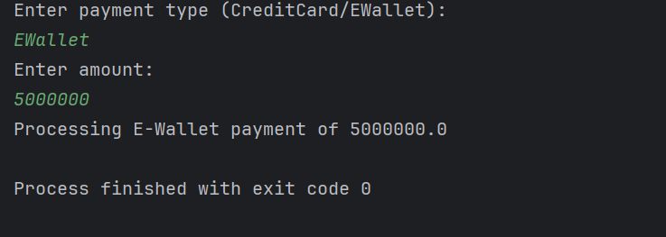
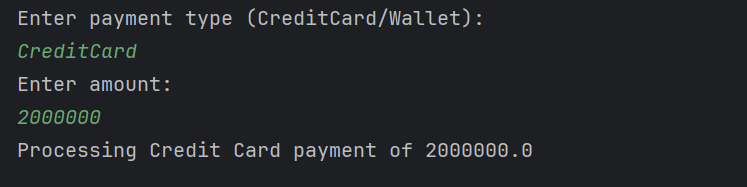
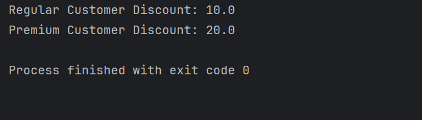
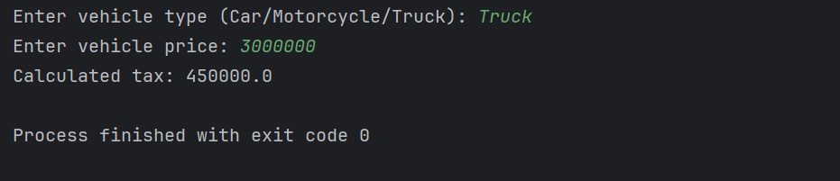

**Mata Kuliah:** Praktikum Design Pattern   
**Nama:** [Ibra Khalid Londang]  
**NIM:** [2024573010115]  
**Kelas:** [TI 1A]

---

# Praktikum 5: SOLID Principle : Open-Closed Principle (OCP)


## Tujuan
1. Memahami prinsip Open-Closed Principle (OCP) dalam SOLID.
2. manfaat penerapan prinsip SOLID dalam pengembangan perangkat lunak.
3. Mampu mengidentifikasi pelanggaran OCP dalam kode.
4. Mampu melakukan refactoring kode agar sesuai dengan prinsip OCP.

SOLID adalah lima prinsip desain dalam pemrograman berorientasi objek (OOP) yang membantu dalam menciptakan perangkat lunak yang mudah dipelihara dan dikembangkan. SOLID terdiri dari:

1. Single Responsibility Principle (SRP)
2. Open-Closed Principle (OCP)
3. Liskov Substitution Principle (LSP)
4. Interface Segregation Principle (ISP)
5. Dependency Inversion Principle (DIP)


## Manfaat penerapan SOLID:
- Meningkatkan keterbacaan dan pemeliharaan kode.
- Mengurangi ketergantungan antar komponen.
- Mempermudah pengujian unit dan integrasi.
- Memudahkan pengembangan fitur baru.

## Single Responsibility Principle (SRP)
Single Responsibility Principle (SRP) atau prinsip tanggung jawab tunggal adalah salah satu dari lima prinsip SOLID dalam desain perangkat lunak yang menyatakan bahwa setiap kelas atau modul dalam sebuah sistem hanya boleh memiliki satu alasan untuk berubah. Artinya, setiap kelas harus memiliki satu tanggung jawab utama atau satu tujuan spesifik.

Prinsip ini pertama kali diperkenalkan oleh Robert C. Martin (Uncle Bob) dalam bukunya "Agile Software Development: Principles, Patterns, and Practices." Tujuan utama SRP adalah untuk meningkatkan modularitas, kemudahan pemeliharaan (maintainability), dan fleksibilitas (extensibility) dalam pengembangan perangkat lunak.

## MMengapa OCP Penting?
- Mengurangi Risiko Bug: Dengan tidak mengubah kode lama, kita menghindari potensi bug yang bisa muncul akibat perubahan kode.
- Meningkatkan Reusability: Kode yang mengikuti OCP lebih mudah digunakan kembali dalam berbagai skenario.
- Mempermudah Pemeliharaan: Karena tidak perlu mengubah kode yang sudah ada, pemeliharaan menjadi lebih mudah.
- Mempercepat Pengembangan: Fitur baru bisa ditambahkan tanpa mengganggu sistem yang sudah berjalan.


## Praktikum
Buatlah sebuah package baru di dalam src dan beri nama modul_5

### Praktikum 1 : Aplikasi Sistem Pembayaran
Program ini menghasilkan laporan, menyimpannya ke file, dan mencetaknya ke console.


#### langgar aturan OCP
1. Buat sebuah package baru di dalam modul_5 dan beri nama praktikum_1
2. Buat sebuah package baru di dalam praktikum_1 dan beri nama tanpa_ocp
3. Buat class baru di dalam tanpa_ocp dengan nama PaymentProcessor dan isikan kode seperti berikut:


````declarative
package modul_5.praktikum_1.tanpa_ocp;

public class PaymentProcessor {
public void processPayment(String paymentType, double amount) {
if (paymentType.equals("CreditCard")) {
System.out.println("Processing Credit Card payment of " + amount);
} else if (paymentType.equals("EWallet")) {
System.out.println("Processing E-Wallet payment of " + amount);
} else {
System.out.println("Invalid payment method");
}
}
}

````
    

4. Buat class Main dan isikan kode berikut:

````declarative
package modul_5.praktikum_1.tanpa_ocp;

import java.util.Scanner;

public class Main {
public static void main(String[] args) {
Scanner scanner = new Scanner(System.in);
System.out.println("Enter payment type (CreditCard/EWallet): ");
String type = scanner.next();
System.out.println("Enter amount: ");
double amount = scanner.nextDouble();

PaymentProcessor processor = new PaymentProcessor();
processor.processPayment(type, amount);
}
}

````

Output:
]


#### Refactor kode diatas untuk mematuhi aturan OCP
1. Buat sebuah package baru di dalam praktikum_1 dan beri nama dengan_ocp
   Buat sebuah interface dengan nama PaymentMethod dan isikan kode berikut:

````declarative
package modul_5.praktikum_1.dengan_ocp;

public interface PaymentMethod {
void process(double amount);
}

````

3. Buat sebuah class dengan nama CreditCardPayment dan isikan kode berikut:

````declarative
package modul_5.praktikum_1.dengan_ocp;

public class CreditCardPayment implements PaymentMethod{
public void process(double amount) {
System.out.println("Processing Credit Card payment of " + amount);
}
}

````

4. Buat sebuah class dengan nama EWalletPayment dan isikan kode berikut:

````declarative
package modul_5.praktikum_1.dengan_ocp;

public class PaymentProcessor {
public void processorPayment(PaymentMethod method, double amount) {
method.process(amount);
}
}

````

5. Buat sebuah class dengan nama PaymentProcessor dan isikan kode berikut:

````declarative
package modul_5.praktikum_1.dengan_ocp;

public class PaymentProcessor {
public void processorPayment(PaymentMethod method, double amount) {
method.process(amount);
}
}

````

6. Buat sebuah class Main dan isikan kode berikut:

````declarative
package modul_5.praktikum_1.dengan_ocp;

import java.util.Scanner;

public class Main {
    public static void main(String[] args) {
        Scanner scanner = new Scanner(System.in);
        System.out.println("Enter payment type (CreditCard/Wallet): ");
        String type = scanner.next();
        System.out.println("Enter amount: ");
        double amount = scanner.nextDouble();

        PaymentProcessor processor = new PaymentProcessor();
        PaymentMethod paymentMethod;

        if (type.equalsIgnoreCase("CreditCard")) {
            paymentMethod = new CreditCardPayment();
        } else if (type.equalsIgnoreCase("EWallet")) {
            paymentMethod = new EWalletPayment();
        } else {
            System.out.println("Invalid payment method");
            return;
        }

        processor.processorPayment(paymentMethod, amount);
    }
}

````

#### Output:



### Praktikum 2 : Sistem Perhitungan Diskon

#### Kode yang melanggar aturan SRP
1. Kode yang melanggar aturan OCP
2. Buat sebuah package baru di dalam modul_5 dan beri nama praktikum_2
3. Buat sebuah package baru di dalam praktikum_2 dan beri nama tanpa_ocp
4. Buat class baru di dalam tanpa_ocp dengan nama DiscountCalculator dan isikan kode seperti berikut:

````declarative
package modul_5.praktikum_2.tanpa_ocp;

public class DiscountCalculator {
public double calculateDiscount(String customerType, double price) {
if (customerType.equals("Regular")) {
return price * 0.1;
} else if (customerType.equals("Premium")) {
return price * 0.2;
} else {
return 0;
}
}
}
````

4. Buat class Main dan isikan kode berikut:

````declarative
package modul_5.praktikum_2.tanpa_ocp;

public class Main {
public static void main(String[] args) {
DiscountCalculator calculator = new DiscountCalculator();

System.out.println("Regular Customer Discount: " +
calculator.calculateDiscount("Regular", 100));

System.out.println("Premium Customer Discount: " +
calculator.calculateDiscount("Premium", 100));
}
}
````

#### Output:



#### Refactor kode diatas untuk mematuhi aturan OCP
1. Buat sebuah package baru di dalam praktikum_2 dan beri nama dengan_ocp
2. Buat sebuah interface dengan nama Discount dan isikan kode berikut:

````declarative
package modul_5.praktikum_2.dengan_ocp;

public interface Discount {
double applyDiscount(double price);
}

````

3. Buat sebuah class dengan nama RegularDiscount dan isikan kode berikut:

````declarative
package modul_5.praktikum_2.dengan_ocp;

public class RegulerDiscount implements Discount{
public double applyDiscount(double price){
return price * 0.1;
}
}

````

4. Buat sebuah class dengan nama PremiumDiscount dan isikan kode berikut:

````declarative
package modul_5.praktikum_2.dengan_ocp;

public class PremiumDiscount implements Discount {
@Override
public double applyDiscount(double price) {
return price * 0.2;
}
}
````

5. Buat sebuah class dengan nama DiscountCalculator dan isikan kode berikut:

````declarative
package modul_5.praktikum_2.dengan_ocp;

public class DiscountCalculator {
public double calculateDiscount(Discount discountStrategy, double price) {
return discountStrategy.applyDiscount(price);
}
}
````


6.Buat sebuah class Main dan isikan kode berikut:
````declarative
package modul_5.praktikum_2.dengan_ocp;

public class Main {
    public static void main(String[] args) {
        DiscountCalculator calculator = new DiscountCalculator();

        Discount regular = new RegulerDiscount();
        Discount premium = new PremiumDiscount();

        System.out.println("Regular Customer Discount: " +
                calculator.calculateDiscount(regular, 100));

        System.out.println("Premium Customer Discount: " +
                calculator.calculateDiscount(premium, 100));
    }
}
````

#### Output:


### Praktikum 3 : Sistem Notifikasi

#### Kode yang melanggar aturan OCP
1. Buat sebuah package baru di dalam modul_5 dan beri nama praktikum_3
2. Buat sebuah package baru di dalam praktikum_2 dan beri nama tanpa_ocp
3. Buat class baru di dalam tanpa_ocp dengan nama NotificationService dan isikan kode seperti berikut:

````declarative
package modul_5.praktikum_3.tanpa_ocp;

public class NotificationService {
    public void sendNotification(String type, String message) {
        if (type.equals("Email")) {
            System.out.println("Sending Email: " + message);
        } else if (type.equals("SMS")) {
            System.out.println("Sending SMS: " + message);
        } else {
            System.out.println("Invalid notification type");
        }
    }
}
````

4. Buat class Main dan isikan kode berikut:
````declarative
package modul_5.praktikum_3.tanpa_ocp;

public class Main {
    public static void main(String[] args) {
        NotificationService service = new NotificationService();
        service.sendNotification("Email", "Hello via Email!");
        service.sendNotification("SMS", "Hello via SMS!");
    }
}
````

#### Output


#### Refactor kode di atas untuk mematuhi aturan OCP
1. Buat sebuah package baru di dalam praktikum_3 dan beri nama dengan_ocp
2. Buat sebuah interface dengan nama Notifier dan isikan kode berikut:

````declarative
package modul_5.praktikum_3.dengan_ocp;

public interface Notifier {
    void send (String message);
}

````

3. Buat sebuah class dengan nama EmailNotifier dan isikan kode berikut:
````declarative
package modul_5.praktikum_3.dengan_ocp;

public class EmailNotifier implements Notifier {
    @Override
    public void send(String message) {
        System.out.println("Sending Email: " + message);
    }
}
````

4. Buat sebuah class dengan nama SMSNotifier dan isikan kode berikut:
````declarative
package modul_5.praktikum_3.dengan_ocp;

public class SMSNotifier implements Notifier {
    @Override
    public void send(String message) {
        System.out.println("Sending SMS: " + message);
    }
}
````

5. Buat sebuah class dengan nama NotificationService dan isikan kode berikut:

````declarative
package modul_5.praktikum_3.dengan_ocp;

public class NotificationService {
    public void sendNotification(Notifier notifier, String message) {
        notifier.send(message);
    }
}
````

6. Buat sebuah class Main dan isikan kode berikut:

````declarative
package modul_5.praktikum_3.dengan_ocp;

public class Main {
    public static void main(String[] args) {
        NotificationService service = new NotificationService();

        Notifier emailNotifier = new EmailNotifier();
        Notifier smsNotifier = new SMSNotifier();

        service.sendNotification(emailNotifier, "Hello via Email!");
        service.sendNotification(smsNotifier, "Hello via SMS!");
    }
}
````


#### Output:


### Latihan

#### Sistem Pengelolaan Pajak
Program ini menghitung pajak berdasarkan jenis kendaraan (Mobil atau Motor). Saat ini, kode yang ada dibawah ini tidak mengikuti OCP, sehingga jika kita ingin menambahkan jenis kendaraan baru (misalnya Truk), kita harus mengubah metode calculateTax(). Kode yang melanggar aturan OCP adalah sebagai berikut:

Modifikasi kode di atas agar memenuhi prinsip OCP, sehingga kita bisa menambahkan jenis kendaraan baru tanpa mengubah kode yang sudah ada.

Petunjuk:

1. Gunakan polimorfisme dengan membuat interface TaxStrategy.
2. Buat class CarTax dan MotorcycleTax yang mengimplementasikan TaxStrategy.
3. Ubah TaxCalculator agar menerima strategi pajak sebagai parameter, bukan langsung menerima vehicleType.
4. Tambahkan kelas baru TruckTax (dengan pajak 15%) tanpa mengubah TaxCalculator.
5. Setelah refactoring, program harus bisa dengan mudah menangani kendaraan baru tanpa mengubah kode TaxCalculator.


Buat class TaxStrategy
````declarative
package modul_5.latihan;

public interface TaxStrategy {
    double calculateTax(double price);
}
````

Buat class CarTax
````declarative
package modul_5.latihan;

public class CarTax implements TaxStrategy {
    @Override
    public double calculateTax(double price) {
        return price * 0.10;
    }
}
````

buat class TruckTax
````declarative
package modul_5.latihan;

public class TruckTax implements TaxStrategy {
    @Override
    public double calculateTax(double price) {
        return price * 0.15;
    }
}
````


Buat class TaxCalculator
````declarative
package modul_5.latihan;

public class TaxCalculator {
    // Menerima interface TaxStrategy sebagai parameter, bukan String vehicleType
    public double calculateTax(TaxStrategy strategy, double price) {
        return strategy.calculateTax(price);
    }
}
````


Buat Class MotorcycleTax
````declarative
package modul_5.latihan;

public class MotorcycleTax implements TaxStrategy {
    @Override
    public double calculateTax(double price) {
        return price * 0.05;
    }
}

````

Buat Class utama yaitu Main
````declarative
package modul_5.latihan;

import java.util.Scanner;

public class Main {
    public static void main(String[] args) {
        Scanner scanner = new Scanner(System.in);

        // Update prompt untuk memasukkan opsi Truk
        System.out.print("Enter vehicle type (Car/Motorcycle/Truck): ");
        String type = scanner.next();

        System.out.print("Enter vehicle price: ");
        double price = scanner.nextDouble();

        TaxStrategy strategy = null;

        // Menentukan strategi berdasarkan input pengguna
        if (type.equalsIgnoreCase("Car")) {
            strategy = new CarTax();
        } else if (type.equalsIgnoreCase("Motorcycle")) {
            strategy = new MotorcycleTax();
        } else if (type.equalsIgnoreCase("Truck")) {
            strategy = new TruckTax();
        } else {
            System.out.println("Unknown vehicle type!");
            scanner.close();
            return;
        }

        TaxCalculator calculator = new TaxCalculator();
        // Memasukkan objek strategy ke dalam metode kalkulator
        double tax = calculator.calculateTax(strategy, price);

        System.out.println("Calculated tax: " + tax);

        scanner.close();
    }
}
````


#### Output:



#### Kesimpulan
Open-Closed Principle (OCP) sangat berguna untuk membuat kode yang lebih fleksibel, mudah dikembangkan, dan dapat diperluas tanpa harus mengubah kode yang sudah ada. Dengan menggunakan polimorfisme, kita bisa memastikan bahwa sistem tetap modular dan scalable.


### Selesai
