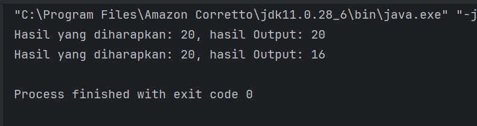
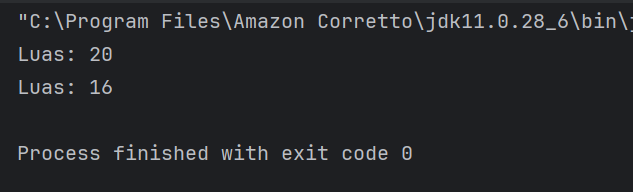
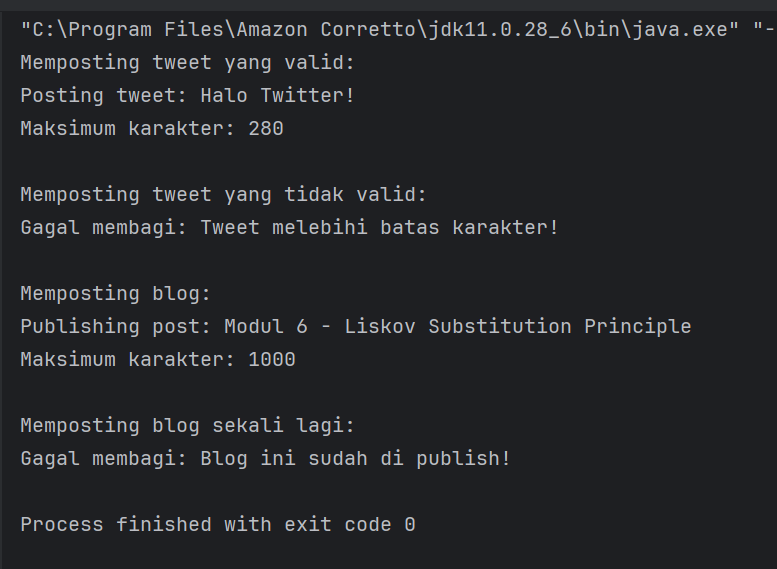
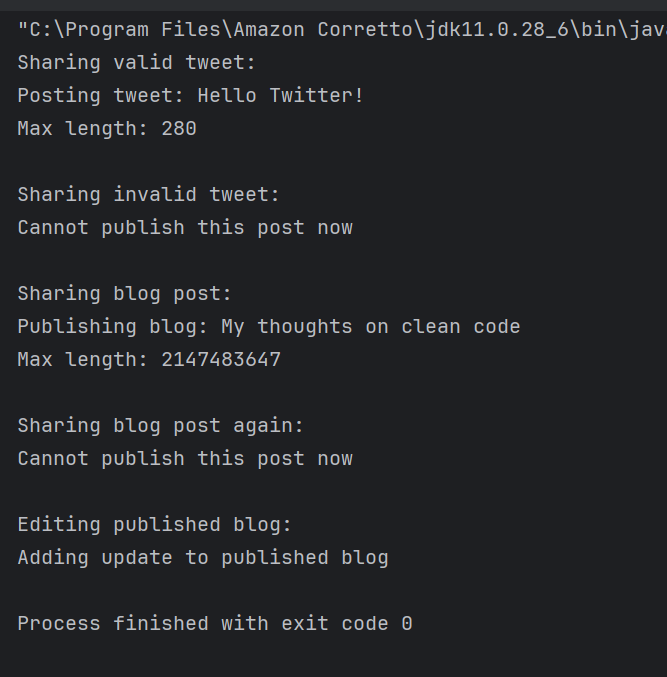
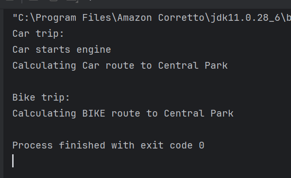
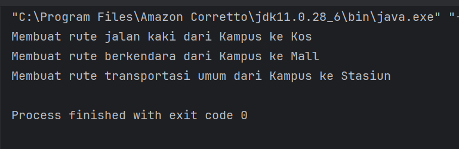
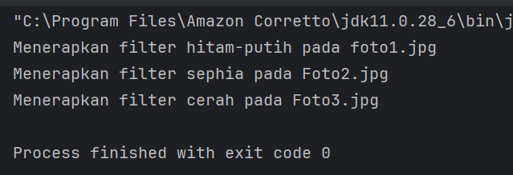
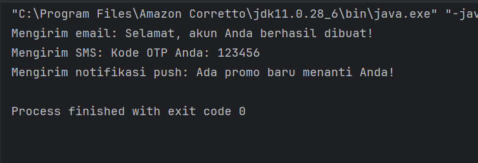
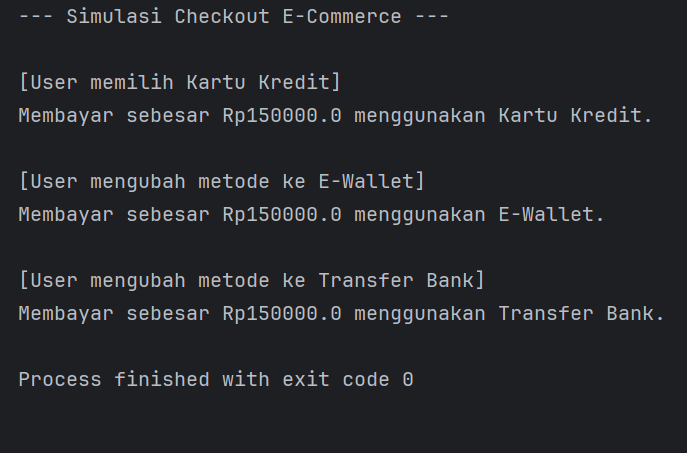

**Mata Kuliah:** Praktikum Design Pattern   
**Nama:** [Ibra Khalid Londang]  
**NIM:** [2024573010115]  
**Kelas:** [TI 1A]

---

# Praktikum 6: SOLID Principle : Liskov Subtitution Principle (LSP)


## Tujuan
1. Memahami konsep Liskov Substitution Principle (LSP) sebagai bagian dari SOLID principles.
2. Menjelaskan manfaat dan tantangan penerapan LSP dalam desain perangkat lunak.
3. Mampu mengidentifikasi pelanggaran prinsip LSP dalam kode.
4. Menerapkan prinsip LSP dalam praktik melalui refactoring kode yang melanggar prinsip ini.

SOLID adalah lima prinsip desain dalam pemrograman berorientasi objek (OOP) yang membantu dalam menciptakan perangkat lunak yang mudah dipelihara dan dikembangkan. SOLID terdiri dari:

1. Single Responsibility Principle (SRP)
2. Open-Closed Principle (OCP)
3. Liskov Substitution Principle (LSP)
4. Interface Segregation Principle (ISP)
5. Dependency Inversion Principle (DIP)


## Manfaat penerapan SOLID:
- Meningkatkan keterbacaan dan pemeliharaan kode.
- Mengurangi ketergantungan antar komponen.
- Mempermudah pengujian unit dan integrasi.
- Memudahkan pengembangan fitur baru.

## Liskov Subtitution Principle (LSP)
Liskov Substitution Principle adalah salah satu prinsip dalam SOLID principles yang pertama kali diperkenalkan oleh Barbara Liskov pada tahun 1987. Prinsip ini menyatakan:

"Jika S adalah subtype dari T, maka objek-objek dari tipe T dalam program harus dapat digantikan dengan objek-objek dari tipe S tanpa mengubah sifat-sifat dari program."

Dalam konteks pemrograman berorientasi objek, ini berarti kelas turunan (subclass) harus bisa digunakan sebagai pengganti kelas induknya (superclass) tanpa menyebabkan kesalahan atau perubahan perilaku yang tidak diinginkan. Objek dari kelas turunan bisa digunakan di mana pun objek dari kelas induknya digunakan tanpa merusak atau mengubah perilaku program yang sudah berjalan dengan benar.

Tujuan utama dari LSP adalah untuk menjaga keandalan dan kestabilan program saat melakukan substitusi objek. Artinya, ketika kita menggunakan objek dari kelas turunan, program tetap bekerja seperti ketika menggunakan objek dari kelas induknya.


## MMengapa LSP Penting?
- Menjamin Keandalan dan Stabilitas Program
  LSP memastikan bahwa subclass dapat menggantikan superclass tanpa mengubah perilaku program. Ini berarti, kode yang kita buat lebih konsisten saat dijalankan. Tidak ada perilaku tak terduga saat subclass digunakan.
- Mempermudah Perawatan dan Perluasan (Maintainability & Extensibility)
  Dengan mematuhi LSP, kita bisa menambahkan class baru (subclass) tanpa mengubah kode yang sudah ada. Kode menjadi modular, sehingga lebih mudah diubah atau dikembangkan.
- Meningkatkan Reusabilitas Kode
  Desain yang sesuai denga LSP menghasilkan class-class yang reusable. Artinya, Komponen bisa dipakai ulang di berbagai tempat tanpa perlu penyesuaian besar. Kita bisa menggunakan polymorphism dengan aman.
- Membantu Menghindari Bug dan Error
  Pelanggaran LSP sering menyebabkan runtime errors (seperti UnsupportedOperationException), Perilaku program yang tidak sesuai harapan dan Sulitnya melakukan debugging. Dengan mematuhi LSP, kita bisa menjamin bahwa semua subclass berperilaku seperti superclass-nya. Menghindari error yang sulit dideteksi.


## Praktikum
BBuat sebuah package baru di dalam src dan beri nama modul_6

### Praktikum 1 : Rectangle-Square Problem


#### langgar aturan LSP
1. Buat sebuah package baru di dalam modul_6 dan beri nama praktikum_1
2. Buat sebuah package baru di dalam praktikum_1 dan beri nama tanpa_lsp
3. Buat class baru di dalam tanpa_lsp dengan nama Rectangle dan isikan kode seperti berikut:


````declarative
package modul_6.praktikum_1.tanpa_lsp;

public class Rectangle {
protected int width;
protected int height;

public void setWidth(int width) {
this.width = width;

}
public void setHeight(int height) {
this.height = height;
}

public int calculateArea() {
return width * height;
}
}

````


4. Buat class Square dan isikan kode berikut:

````declarative
package modul_6.praktikum_1.tanpa_lsp;

import java.security.PublicKey;

public class Square extends Rectangle {
@Override
public void setWidth(int width) {
super.setWidth(width);
super.setHeight(width);
}

@Override
public void setHeight(int height) {
super.setHeight(height);
super.setWidth(height);
}
}


````

5. Buat class Main:

````declarative
package modul_6.praktikum_1.tanpa_lsp;

public class Main {
    public static void testRectangle(Rectangle r){
        r.setWidth(5);
        r.setHeight(4);
        System.out.println("Hasil yang diharapkan: 20, hasil Output: " + r.calculateArea());
    }

    public static void main(String[] args) {
        Rectangle rect = new Rectangle();
        testRectangle(rect);

        Rectangle square = new Square();
        testRectangle(square);
    }
}

````

Output:



#### Refactor kode diatas untuk mematuhi aturan LSP
1. Buat sebuah package baru di dalam praktikum_1 dan beri nama dengan_lsp
2. Buat sebuah interface dengan nama Shape dan isikan kode berikut:

````declarative
package modul_6.praktikum_1.dengan_lsp;

public interface Shape {
int calculateArea();
}


````

3. Buat sebuah class dengan nama Rectangle dan isikan kode berikut:

````declarative
package modul_6.praktikum_1.dengan_lsp;

public class Rectangle implements Shape {
private int width;
private int height;

public Rectangle(int width, int height) {
this.width = width;
this.height = height;
}

@Override
public int calculateArea() {
return width * height;
}
}


````

4. Buat sebuah class dengan nama Square dan isikan kode berikut:

````declarative
package modul_6.praktikum_1.dengan_lsp;

public class Square implements Shape{
private int side;

public Square(int side) {
this.side = side;
}

@Override
public int calculateArea() {
return side * side;
}
}


````

5. Buat sebuah class dengan nama Main dan isikan kode berikut:

````declarative
package modul_6.praktikum_1.dengan_lsp;

public class Main {
public static void printArea(Shape shape) {
System.out.println("Luas: " + shape.calculateArea());
}

public static void main(String[] args) {
Shape rectangle = new Rectangle(5, 4);
Shape square = new Square(4);

printArea(rectangle);
printArea(square);
}
}


````


#### Output:



### Praktikum 2 : Sistem Posting Media Sosial

#### Kode yang melanggar aturan LSP
1. Buat sebuah package baru di dalam modul_6 dan beri nama praktikum_2
2. Buat sebuah package baru di dalam praktikum_2 dan beri nama tanpa_lsp
3. Buat class baru di dalam tanpa_lsp dengan nama SocialMediaPost dan isikan kode seperti berikut:

````declarative
package modul_6.praktikum_2.tanpa_lsp;

public class SocialMediaPost {
protected String content;

public SocialMediaPost(String content) {
this.content = content;
}

public void publish() {
System.out.println("Publishing post: " + content);
}

public int calculateMaxCharacters() {
return 1000;
}
}

````

4. Buat class TwitterPost dan isikan kode berikut:

````declarative
package modul_6.praktikum_2.tanpa_lsp;

public class TwitterPost extends SocialMediaPost{
public TwitterPost(String content) {
super(content);
}

@Override
public int calculateMaxCharacters() {
return 280; // Batas karakter twitter
}

@Override
public void publish() {
if (content.length() > calculateMaxCharacters()) {
throw new IllegalArgumentException("Tweet melebihi batas karakter!");
}
System.out.println("Posting tweet: " + content);
}
}
````


5. Buat Class BlogPost:
````declarative
package modul_6.praktikum_2.tanpa_lsp;

public class BlogPost extends SocialMediaPost {
    private boolean isDraft;

    public BlogPost(String content) {
        super(content);
        this.isDraft = true;
    }

    @Override
    public void publish() {
        if (!isDraft) {
            throw new IllegalStateException("Blog ini sudah di publish!");
        }
        isDraft = false;
        super.publish();
    }

    public void editContent(String newContent) {
        if (!isDraft) {
            throw new IllegalStateException("Blog yang sudah di publish tidak bisa diedit!");
        }
        this.content = newContent;
    }
}
````

6. Buat Class Main
````declarative
package modul_6.praktikum_2.tanpa_lsp;

public class BlogPost extends SocialMediaPost {
    private boolean isDraft;

    public BlogPost(String content) {
        super(content);
        this.isDraft = true;
    }

    @Override
    public void publish() {
        if (!isDraft) {
            throw new IllegalStateException("Blog ini sudah di publish!");
        }
        isDraft = false;
        super.publish();
    }

    public void editContent(String newContent) {
        if (!isDraft) {
            throw new IllegalStateException("Blog yang sudah di publish tidak bisa diedit!");
        }
        this.content = newContent;
    }
}
````

#### Output:



#### Refactor kode diatas untuk mematuhi aturan LSP
1. Buat sebuah package baru di dalam praktikum_2 dan beri nama dengan_lsp
2. Buat sebuah interface dengan nama Publishable dan isikan kode berikut:

````declarative
package modul_6.praktikum_2.dengan_lsp;

public interface Publishable {
    void publish();
    boolean canPublish();
    int getMaxContentLength();
}
````
3. Buatlah sebuah Class SocialPost
````declarative
package modul_6.praktikum_2.dengan_lsp;

public class SocialPost implements Publishable {
protected String content;

public SocialPost(String content) {
this.content = content;
}

@Override
public void publish() {
System.out.println("Publishing: " + content);
}

@Override
public boolean canPublish() {
return content.length() <= getMaxContentLength();
}

@Override
public int getMaxContentLength() {
return 1000;
}
}

````

4. Buat sebuah class dengan nama TwitterPost dan isikan kode berikut:

````declarative
package modul_6.praktikum_2.dengan_lsp;

public class TwitterPost implements Publishable {
private static final int MAX_LENGTH = 280;
private String content;

public TwitterPost(String content) {
this.content = content;
}

@Override
public void publish() {
if (!canPublish()) {
throw new IllegalArgumentException("Tweet exceeds " + MAX_LENGTH + " characters");
}
System.out.println("Posting tweet: " + content);
}

@Override
public boolean canPublish() {
return content.length() <= MAX_LENGTH;
}

@Override
public int getMaxContentLength() {
return MAX_LENGTH;
}
}

````

5. Buat sebuah class dengan nama BlogPost dan isikan kode berikut:

````declarative
package modul_6.praktikum_2.dengan_lsp;

public class BlogPost implements Publishable {
private String content;
private boolean isPublished;

public BlogPost(String content) {
this.content = content;
this.isPublished = false;
}

@Override
public void publish() {
if (isPublished) {
return; // Idempotent operation
}
isPublished = true;
System.out.println("Publishing blog: " + content);
}

@Override
public boolean canPublish() {
return !isPublished;
}

@Override
public int getMaxContentLength() {
return Integer.MAX_VALUE; // No practical limit
}

public void editContent(String newContent) {
if (isPublished) {
System.out.println("Adding update to published blog");
}
this.content = newContent;
}
}
````

6. Buat sebuah class dengan nama DiscountCalculator dan isikan kode berikut:

````declarative
package modul_6.praktikum_2.dengan_lsp;


public class Main {
public static void sharePost(Publishable post) {
if (post.canPublish()) {
post.publish();
System.out.println("Max length: " + post.getMaxContentLength());
} else {
System.out.println("Cannot publish this post now");
}
}

public static void main(String[] args) {
Publishable tweet = new TwitterPost("Hello Twitter!");
Publishable longTweet = new TwitterPost("This is way too long...".repeat(20));
Publishable blog = new BlogPost("My thoughts on clean code");

System.out.println("Sharing valid tweet:");
sharePost(tweet);

System.out.println("\nSharing invalid tweet:");
sharePost(longTweet);

System.out.println("\nSharing blog post:");
sharePost(blog);

System.out.println("\nSharing blog post again:");
sharePost(blog); // Now handles gracefully

System.out.println("\nEditing published blog:");
((BlogPost)blog).editContent("Updated thoughts on clean code");
}
}
````


#### Output:



### Latihan: Aplikasi sistem navigasi kendaraan

1. Buat sebuah package baru di dalam modul_6 dengan nama latihan
2. Tuliskan solusi Anda dalam package tersebut.

Kode:
1. Buat Class Navigable dan isikan kode berikut:

````declarative
package modul_6.latihan;

public interface Navigable {
void navigateTo(String destination);
}
````

2. Buat sebuah Class EnginePowered dan isikan kode berikut:

````declarative
package modul_6.latihan;

public interface EnginePowered {
void startEngine();
}
````

3. Buat sebuah Class Car dan isikan kode berikut:

````declarative
package modul_6.latihan;

public class Car implements Navigable, EnginePowered {
@Override
public void startEngine() {
System.out.println("Car starts engine");
}

@Override
public void navigateTo(String destination) {
System.out.println("Calculating Car route to " + destination);
}
}
````

4. Buat sebuah Class Bicycle dan isikan kode berikut:
````declarative
package modul_6.latihan;

public class Bicycle implements Navigable {
@Override
public void navigateTo(String destination) {
System.out.println("Calculating BIKE route to " + destination);
// Menggunakan logika rute khusus sepeda (misal: lewat jalur sepeda)
}
}
````

5. Buat sebuah Class Main dan isikan kode Berikut:

````declarative
package modul_6.latihan;

public class Main {
    // Kontrak parameter diganti menjadi Navigable karena inti dari trip adalah navigasi
    public static void beginTrip(Navigable vehicle, String destination) {
        // Cek secara defensif polimorfis: Jika kendaraan punya mesin, nyalakan dulu
        if (vehicle instanceof EnginePowered) {
            ((EnginePowered) vehicle).startEngine();
        }

        // Semua kendaraan pasti bisa mengeksekusi ini dengan aman
        vehicle.navigateTo(destination);
    }

    public static void main(String[] args) {
        Navigable car = new Car();
        Navigable bike = new Bicycle();

        System.out.println("Car trip:");
        beginTrip(car, "Central Park");

        System.out.println("\nBike trip:");
        // Sekarang berjalan mulus tanpa perlu try-catch blocks yang mengantisipasi crash
        beginTrip(bike, "Central Park");
    }
}
````

#### Output



# Praktikum 7: Strategy Pattern


## Tujuan
1. Memahami konsep Strategy Pattern dan manfaatnya dalam desain perangkat lunak.
2. Mengimplementasikan Strategy Pattern dalam bahasa pemrograman Java.
3. Mampu mengidentifikasi situasi yang cocok untuk penggunaan Strategy Pattern

## Strategy Singkat

Strategy Pattern adalah sebuah pola desain (design pattern) dalam pemrograman yang memungkinkan definisi serangkaian algoritma terpisah, mengenkapsulasi setiap algoritma, dan membuatnya dapat saling bertukar secara dinamis sesuai kebutuhan. Pola ini memisahkan algoritma dari kelas yang menggunakannya, sehingga memungkinkan perubahan algoritma tanpa mengubah kelas klien yang memanfaatkannya.

Dalam Strategy Pattern, algoritma diimplementasikan sebagai objek terpisah yang disebut strategi (strategy). Kelas klien yang menggunakan algoritma memiliki referensi ke salah satu objek strategi tersebut, dan menggunakan strategi tersebut untuk mengeksekusi algoritma tertentu.

Dengan menggunakan Strategy Pattern, kita dapat mencapai beberapa keuntungan, antara lain:

1. Fleksibilitas: Kita dapat dengan mudah mengganti algoritma yang digunakan oleh kelas klien tanpa mempengaruhi struktur kelas klien tersebut.
2. Pemisahan Kode: Algoritma-algoritma yang berbeda dienkapsulasi secara terpisah, sehingga memisahkan tanggung jawab dan mempermudah pemeliharaan serta pengembangan kode.
3. Mudah diuji: Memisahkan algoritma ke dalam objek terpisah memungkinkan pengujian yang lebih mudah, karena setiap algoritma dapat diuji secara terpisah.
4. Kode yang dapat digunakan kembali(reusable): Objek strategi dapat digunakan kembali dalam berbagai konteks yang berbeda, tanpa perlu mengubah kelas klien.

Dengan demikian, Strategy Pattern sangat berguna ketika kita memiliki serangkaian algoritma yang berbeda dan perlu memilih algoritma yang sesuai secara dinamis, atau ketika kita ingin meningkatkan fleksibilitas dan pemeliharaan kode dalam pengembangan perangkat lunak.


### Praktikum

#### Praktikum 1 : Program Navigasi Sederhana
##### Use Case
Aplikasi navigasi bisa menggunakan berbagai strategi rute: jalan kaki, berkendara, atau transportasi umum.

Langkah Praktikum
1. Buat sebuah package baru di dalam modul_9 dan beri nama praktikum_1
2. Kemudian buat sebuah interface RouteStrategy dan isikan kode berikut:

````declarative
package modul_7.praktikum_1;

// Strategy Interface
interface RouteStrategy {
void buildRoute(String from, String to);
}
````

3. Buat class WalkingRoute dan isikan kode berikut:
````declarative
package modul_7.praktikum_1;

// Strategy
public class WalkingRoute implements RouteStrategy {
@Override
public void buildRoute(String from, String to) {
System.out.println("Membuat rute jalan kaki dari " + from + " ke " + to);
}
}
````

4. Buat class DrivingRoute dan isikan kode berikut:
````declarative
package modul_7.praktikum_1;

// Strategy
public class DrivingRoute implements RouteStrategy {
@Override
public void buildRoute(String from, String to) {
System.out.println("Membuat rute berkendara dari " + from + " ke " + to);
}
}
````

5. Buat class PublicTransportRoute dan isikan kode berikut:
````declarative
package modul_7.praktikum_1;

// Strategy
public class PublicTransportRoute implements RouteStrategy {
@Override
public void buildRoute(String from, String to) {
System.out.println("Membuat rute transportasi umum dari " + from + " ke " + to);
}
}
````


6. Buat class Navigator dan isikan kode berikut:
````declarative
package modul_7.praktikum_1;

// Context
public class Navigator {
private RouteStrategy strategy;

public Navigator() {}

public void setStrategy(RouteStrategy strategy) {
this.strategy = strategy;
}

public void navigate(String from, String to) {
strategy.buildRoute(from, to);
}
}

````

7. Buat class Main dan isikan kode berikut:
````declarative
package modul_7.praktikum_1;

public class Main {
public static void main(String[] args) {
Navigator nav = new Navigator();

nav.setStrategy(new WalkingRoute());
nav.navigate("Kampus", "Kos");

nav.setStrategy(new DrivingRoute());
nav.navigate("Kampus", "Mall");

nav.setStrategy(new PublicTransportRoute());
nav.navigate("Kampus", "Stasiun");
}
}
````


#### Output:


#### Praktikum 2 : Program Filter Foto Sederhana
##### Use Case
Aplikasi editing foto menyediakan berbagai filter: hitam-putih, sephia, dan cerah. Pengguna dapat memilih filter saat runtime.

#### Langkah Praktikum
1. Buat sebuah package baru di dalam modul_9 dan beri nama praktikum_2
2. Kemudian buat sebuah interface FilterStrategy dan isikan kode berikut:

````declarative
package modul_7.praktikum_2;

public interface FilterStrategy {
    void apply(String fileName);
}

````

3. Buat class BlackWhiteFilter dan isikan kode berikut:
````declarative
package modul_7.praktikum_2;

public class BlackWhiteFilter implements FilterStrategy {
    public void apply(String fileName) {
        System.out.println("Menerapkan filter hitam-putih pada " + fileName);
    }
}

````

4. Buat class SepiaFilter dan isikan kode berikut:
````declarative
package modul_7.praktikum_2;

public class SepiaFIlter implements FilterStrategy {
    public void apply(String fileName) {
        System.out.println("Menerapkan filter sephia pada " + fileName);
    }
}

````

5. Buat class BrightFilter dan isikan kode berikut:
````declarative
package modul_7.praktikum_2;

public class BrightFilter implements FilterStrategy {
    public void apply(String fileName) {
        System.out.println("Menerapkan filter cerah pada " + fileName);
    }
}

````

6. Buat class PhotoEditor dan isikan kode berikut:
````declarative
package modul_7.praktikum_2;

public class PhotoEditor {
    private FilterStrategy filter;

    public PhotoEditor() {}

    public void setFilter(FilterStrategy filter) {
        this.filter = filter;
    }

    public void applyFilter(String fileName) {
        filter.apply(fileName);
    }
}

````

7. Buat class Main dan isikan kode berikut:
````declarative
package modul_7.praktikum_2;

public class Main {
    public static void main(String[] args) {
        PhotoEditor editor = new PhotoEditor();

        editor.setFilter(new BlackWhiteFilter());
        editor.applyFilter("foto1.jpg");

        editor.setFilter(new SepiaFIlter());
        editor.applyFilter("Foto2.jpg");

        editor.setFilter((new BrightFilter()));
        editor.applyFilter("Foto3.jpg");
    }
}

````


#### Output:



#### Praktikum 3 : Program Notifikasi
##### Use Case
Sistem dapat mengirim notifikasi dengan berbagai cara tergantung situasi pengguna: email, SMS, atau push.

#### Langkah Praktikum
1. Buat sebuah package baru di dalam modul_9 dan beri nama praktikum_3
2. Kemudian buat sebuah interface NotificationStrategy dan isikan kode berikut:

````declarative
package modul_7.praktikum_3;

public interface NotificationStrategy {
    void send(String message);
}

````

3. Buat class EmailNotification dan isikan kode berikut:

````declarative
package modul_7.praktikum_3;

public class EmailNotification implements NotificationStrategy{
    public void send(String message) {
        System.out.println("Mengirim email: " + message);
    }
}

````

4. Buat class SMSNotification dan isikan kode berikut:

````declarative
package modul_7.praktikum_3;

public class SMSNotification implements NotificationStrategy{
    public void send(String message) {
        System.out.println("Mengirim SMS: " + message);
    }
}

````

5. Buat class PushNotification dan isikan kode berikut:

````declarative
package modul_7.praktikum_3;

public class PushNotification implements NotificationStrategy{
    public void send(String message) {
        System.out.println("Mengirim notifikasi push: " + message);
    }
}

````

6. Buat class NotificationService dan isikan kode berikut:

````declarative
package modul_7.praktikum_3;

public class NotificationService {
    private NotificationStrategy strategy;

    public NotificationService() {}

    public void setStrategy(NotificationStrategy strategy) {
        this.strategy = strategy;
    }

    public void notifyUser(String message) {
        strategy.send(message);
    }
}
````

7. Buat Class Main dan isikan dengan kode berikut:

````declarative
package modul_7.praktikum_3;

public class Main {
    public static void main(String[] args) {
        NotificationService notif = new NotificationService();

        notif.setStrategy(new EmailNotification());
        notif.notifyUser("Selamat, akun Anda berhasil dibuat!");

        notif.setStrategy(new SMSNotification());
        notif.notifyUser("Kode OTP Anda: 123456");

        notif.setStrategy(new PushNotification());
        notif.notifyUser("Ada promo baru menanti Anda!");
    }
}
````


#### Output:


#### Soal Latihan : Program Pembayaran E-Commerce (Strategy Pattern)
Deskripsi:
Anda diminta untuk mengembangkan sistem checkout sederhana yang mendukung tiga jenis metode pembayaran:
- Kartu Kredit
- E-Wallet
- Transfer Bank

#### Tugas Praktikum:
1. Buat interface PaymentStrategy dengan method pay(double amount).
2. Buat tiga class yang mengimplementasikan PaymentStrategy yaitu: CreditCardPayment, EWalletPayment, dan BankTransferPayment.
3. Buat class Checkout(Contex Class) yang menggunakan PaymentStrategy.
4. Di dalam main, tunjukkan contoh penggunaan masing-masing metode pembayaran.

#### Code Program:
1. Buat Interface PaymentStategy

````declarative
package modul_7.praktikum_3.latihan.praktikum;

public interface PaymentStrategy {
    void pay(double amount);
}
````

2. Buat class Checkout
````declarative
package modul_7.praktikum_3.latihan.praktikum;

public class Checkout {
    private PaymentStrategy paymentStrategy;

    // Mengosongkan constructor atau mengizinkan instansiasi awal tanpa strategi
    public Checkout() {}

    public void setPaymentStrategy(PaymentStrategy paymentStrategy) {
        this.paymentStrategy = paymentStrategy;
    }

    public void processPayment(double amount) {
        if (paymentStrategy == null) {
            System.out.println("Gagal: Silakan pilih metode pembayaran terlebih dahulu!");
            return;
        }
        paymentStrategy.pay(amount);
    }
}
````

3. Buat Class CreditCardPayment
````declarative
package modul_7.praktikum_3.latihan.praktikum;

public class CreditCardPayment implements PaymentStrategy {
    @Override
    public void pay(double amount) {
        System.out.println("Membayar sebesar Rp" + amount + " menggunakan Kartu Kredit.");
    }
}
````

4. Buat Class BankTransferPayemnt
````declarative
package modul_7.praktikum_3.latihan.praktikum;

public class BankTransferPayment implements PaymentStrategy {
    @Override
    public void pay(double amount) {
        System.out.println("Membayar sebesar Rp" + amount + " menggunakan Transfer Bank.");
    }
}
````

5. Buat Class EWalletPayment
````declarative
package modul_7.praktikum_3.latihan.praktikum;

public class EWalletPayment implements PaymentStrategy {
    @Override
    public void pay(double amount) {
        System.out.println("Membayar sebesar Rp" + amount + " menggunakan E-Wallet.");
    }
}
````

6. Last, Buat Class Main
````declarative
package modul_7.praktikum_3.latihan.praktikum;

public class Main {
    public static void main(String[] args) {
        Checkout cart = new Checkout();
        double totalBelanja = 150000.0;

        System.out.println("--- Simulasi Checkout E-Commerce ---\n");

        // 1. Pengujian Kartu Kredit
        System.out.println("[User memilih Kartu Kredit]");
        cart.setPaymentStrategy(new CreditCardPayment());
        cart.processPayment(totalBelanja);

        System.out.println();

        // 2. Pengujian E-Wallet
        System.out.println("[User mengubah metode ke E-Wallet]");
        cart.setPaymentStrategy(new EWalletPayment());
        cart.processPayment(totalBelanja);

        System.out.println();

        // 3. Pengujian Transfer Bank
        System.out.println("[User mengubah metode ke Transfer Bank]");
        cart.setPaymentStrategy(new BankTransferPayment());
        cart.processPayment(totalBelanja);
    }
}
````

#### Output:

